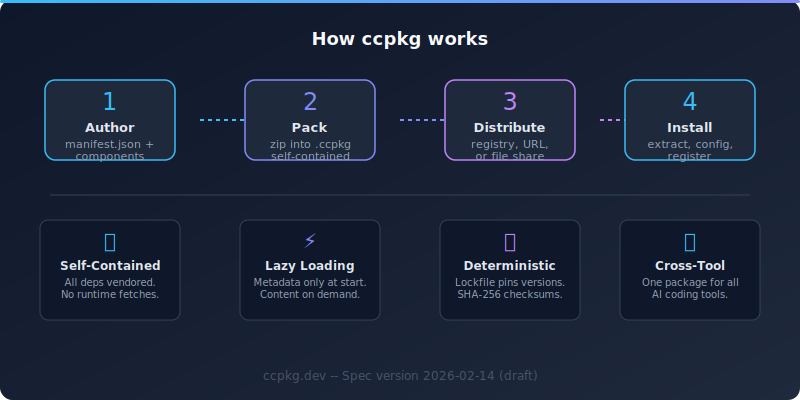

# ccpkg

[](https://ccpkg.dev/spec/specification.html)
[](#status)
[](https://creativecommons.org/licenses/by/4.0/)
[](https://ccpkg.dev)
[](https://github.com/zircote/ccpkg/discussions)

> An open packaging format for AI coding assistant extensions.

ccpkg is a self-contained archive format for packaging and distributing skills, agents, commands, hooks, MCP servers, and LSP servers as a single portable unit. One file, one install, zero post-install steps.

<picture>
  <source media="(prefers-color-scheme: dark)" srcset=".github/readme-infographic.svg">
  
</picture>

## The Problem

AI coding assistants are increasingly extensible, but sharing extensions is fragmented:

- **Brittleness** -- Extensions installed from Git repos break silently when authors push changes. No version pinning, no integrity verification, no dependency vendoring.
- **Slow startup** -- Every session start fetches plugin state from remote repos. Multiple plugins mean minutes of latency before the assistant is ready.
- **No trust signals** -- Finding good extensions means word-of-mouth. No curation, no verification, no structured metadata to filter by.
- **Configuration burden** -- MCP server configs end up buried in plugin cache directories. Secrets, env vars, and auth tokens require editing opaque files.

## The Solution

A `.ccpkg` file is a standard ZIP archive containing a declarative `manifest.json` and all extension components. Install is deterministic: extract, configure, register. No post-install scripts, no network fetches, no build steps.

```
example-plugin-1.0.0.ccpkg (ZIP)
├── manifest.json           # Package identity, components, config
├── skills/                 # SKILL.md files (Agent Skills format)
├── agents/                 # AGENT.md files
├── commands/               # Slash command definitions
├── hooks/                  # Event handlers (hooks.json + scripts)
├── mcp/                    # MCP server config template
├── lsp/                    # LSP server config template
├── instructions/           # INSTRUCTIONS.md + tool-specific mappings
└── LICENSE
```

## Key Features

- **Self-contained archives** -- All dependencies vendored inside. No runtime network fetches.
- **Cross-tool portability** -- Works across Claude Code, Gemini CLI, Codex, Copilot, and other compatible tools. Built on universal standards (MCP, LSP, Agent Skills).
- **Lazy loading** -- Only metadata loaded at startup. Full content loaded on demand. Twenty installed packages have the same startup time as zero.
- **Typed configuration** -- Manifest declares config slots (secrets, strings, enums, paths). Users configure once at install time. Templates wire values into MCP/LSP configs automatically.
- **Deterministic lockfiles** -- `ccpkg-lock.json` pins exact versions with checksums. Commit it to share identical environments across a team.
- **Decentralized registries** -- No central authority required. Registries are JSON files hostable on GitHub Pages, S3, or any static server.
- **Install scope control** -- User flag always wins. Install globally (`~/.claude/packages/`) or per-project (`<project>/.claude/packages/`).
- **Dev mode** -- Symlink local directories for live development without re-packing.

## Built On Open Standards

| Standard | Role in ccpkg |
|---|---|
| [Agent Skills](https://agentskills.io/) | Skill format (SKILL.md) |
| [Model Context Protocol](https://modelcontextprotocol.io/) | MCP server configuration |
| [Language Server Protocol](https://microsoft.github.io/language-server-protocol/) | LSP server configuration |
| [Semantic Versioning](https://semver.org/) | Package versioning |
| [JSON Schema](https://json-schema.org/) | Manifest validation |

## Documentation

| Document | Description |
|---|---|
| [Specification](https://ccpkg.dev/spec/specification.html) | Formal format definition (RFC 2119 conventions) |
| [Design Document](https://ccpkg.dev/docs/plans/2026-02-14-ccpkg-design.html) | Rationale and decisions behind the design |
| [Manifest Schema](https://ccpkg.dev/spec/schemas/manifest.schema.json) | Machine-readable JSON Schema for manifest.json |

## Example Manifest

```json
{
  "spec_version": "2026-02-14",
  "name": "api-testing",
  "version": "1.0.0",
  "description": "Skills and tools for API testing workflows.",
  "author": {
    "name": "Example Org",
    "url": "https://github.com/example-org"
  },
  "license": "MIT",
  "scope": "project",
  "components": {
    "skills": ["skills/openapi-validator", "skills/request-generator"],
    "commands": ["commands/run-tests.md"],
    "hooks": "hooks/hooks.json",
    "mcp": "mcp/.mcp.json",
    "instructions": "instructions/INSTRUCTIONS.md"
  },
  "config": {
    "API_BASE_URL": {
      "type": "string",
      "description": "Base URL for the target API.",
      "required": true
    },
    "API_KEY": {
      "type": "secret",
      "description": "Authentication key for the target API.",
      "required": true
    }
  },
  "targets": {
    "claude": { "instructions_file": "CLAUDE.md" },
    "codex": { "instructions_file": "AGENTS.md" }
  }
}
```

## Status

This specification is a **draft** (version 2026-02-14). The format is stable enough for experimentation and feedback but may change before 1.0.

## Contributing

Feedback and contributions are welcome:

- [Open an issue](https://github.com/zircote/ccpkg/issues) for bug reports, questions, or feature requests
- [Submit a pull request](https://github.com/zircote/ccpkg/pulls) for spec improvements or corrections
- Join the discussion in [GitHub Discussions](https://github.com/zircote/ccpkg/discussions)

## License

This specification is published under [CC-BY-4.0](https://creativecommons.org/licenses/by/4.0/).
