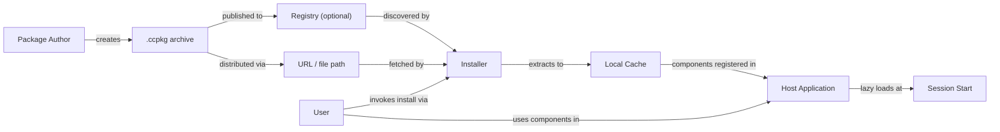
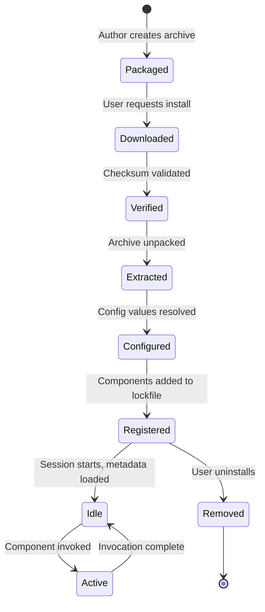
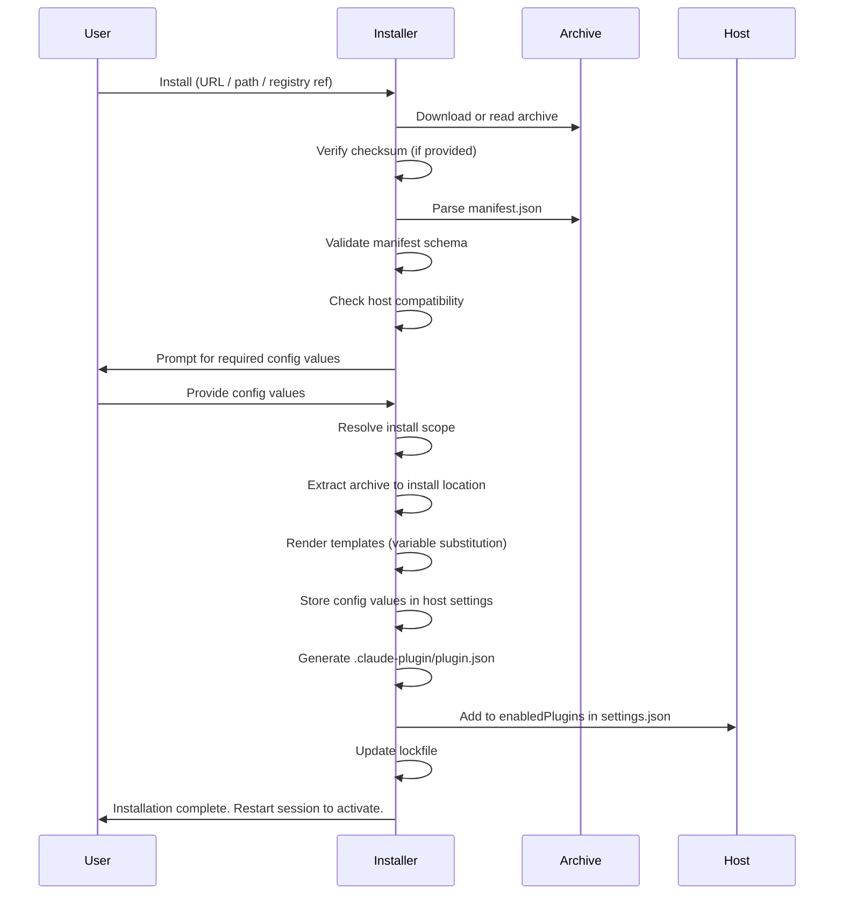

# ccpkg Specification

**Specification Version: 2026-02-14 (Draft)**

## Status

This specification is a **draft** and is subject to change. Feedback and contributions are welcome.

---

## Introduction

ccpkg is an open packaging format for distributing AI coding assistant extensions. A ccpkg archive is a self-contained ZIP file with a declarative manifest that bundles skills, agents, commands, hooks, MCP servers, LSP servers, and configuration instructions into a single portable unit.

The format is designed around a universal core—MCP, LSP, Agent Skills, and declarative configuration—with thin, tool-specific adapters that map these universal components to the conventions of individual AI coding assistants. This architecture enables a single package to work across Claude Code, OpenAI Codex CLI, GitHub Copilot, Google Gemini CLI, and other tools that adopt the format.

For implementation guides and tooling, visit the [ccpkg repository](https://github.com/zircote/ccpkg).

### Notational Conventions

The key words "MUST", "MUST NOT", "REQUIRED", "SHALL", "SHALL NOT", "SHOULD", "SHOULD NOT", "RECOMMENDED", "NOT RECOMMENDED", "MAY", and "OPTIONAL" in this document are to be interpreted as described in [BCP 14](https://datatracker.ietf.org/doc/html/bcp14) [[RFC 2119](https://datatracker.ietf.org/doc/html/rfc2119)] [[RFC 8174](https://datatracker.ietf.org/doc/html/rfc8174)] when, and only when, they appear in all capitals, as shown here.

### Relationship to Other Specifications

ccpkg builds on and references the following specifications:

| Specification | Role in ccpkg |
|---|---|
| [Model Context Protocol (MCP)](https://modelcontextprotocol.io/specification/2025-11-25) | MCP server configuration and transport definitions |
| [Agent Skills](https://agentskills.io/specification) | Skill and agent component format (SKILL.md, AGENT.md) |
| [Language Server Protocol (LSP)](https://microsoft.github.io/language-server-protocol/) | LSP server configuration |
| [Semantic Versioning 2.0.0](https://semver.org/) | Package version numbering |
| [SPDX License List](https://spdx.org/licenses/) | License identifiers |
| [JSON Schema](https://json-schema.org/) | Config schema validation |

---

## Design Principles

The following principles guide the design of the ccpkg format. Implementors SHOULD consider these principles when making decisions not explicitly covered by this specification.

1. **Self-contained archives.** Packages MUST be self-contained. Installation MUST NOT require network fetches, dependency resolution, or compilation. All executable content, configuration templates, and metadata MUST be present in the archive at packaging time.

2. **Tool-agnostic core.** The format MUST be tool-agnostic at its core. MCP, LSP, and Agent Skills are universal open standards. Tool-specific behavior is expressed through thin adapter mappings, not fundamental format changes.

3. **Deterministic installation.** Installation MUST be deterministic. Given the same package archive and the same user configuration, the installed result MUST be identical.

4. **Lazy loading.** Installers SHOULD support lazy loading. Only package metadata is loaded at session startup; full component content is loaded on demand when invoked. This minimizes startup time and context token consumption.

5. **No central authority.** No central registry is REQUIRED. Packages MAY be distributed via any URL, file path, or registry. Registries are optional and additive.

6. **Separated configuration.** User configuration MUST be separated from package contents. Secrets, preferences, and environment-specific values live outside the archive and are injected at install or load time.

7. **No install-time code execution.** Packages MUST NOT execute arbitrary code during installation. There are no postinstall scripts, no build steps, and no setup hooks. The installation process is purely declarative: extract, configure, register.

8. **No inter-package dependencies.** Inter-package dependencies are explicitly out of scope for this specification version. Each package MUST be self-contained and MUST NOT declare dependencies on other ccpkg packages. If a skill requires an MCP server, both MUST be packaged together in a single `.ccpkg` archive.

---

## Architecture

### Overview

ccpkg defines a packaging and distribution pipeline that connects package authors to end users through an optional registry layer. The architecture separates concerns across five roles: Author, Registry, Installer, Host, and User.



### Roles

| Role | Description |
|---|---|
| **Package Author** | Creates the `.ccpkg` archive containing components and a manifest. Authors are responsible for correctness, licensing, and security of package contents. |
| **Registry** | An OPTIONAL service or static file that indexes available packages. Registries provide discovery and version resolution but are not required for installation. |
| **Installer** | The tool or skill that processes `.ccpkg` archives. The installer downloads, verifies, extracts, configures, and registers packages. The ccpkg skill itself serves as the reference installer implementation. |
| **Host** | The AI coding assistant (e.g., Claude Code, Codex CLI) that loads and uses installed components. The host is responsible for component activation, lazy loading, and runtime integration. |
| **User** | The person who installs and uses packages. Users provide configuration values, approve hook scripts, and control what packages are active. |

### Component Lifecycle



---

## Archive Format

### File Extension and MIME Type

| Property | Value |
|---|---|
| File extension | `.ccpkg` |
| MIME type | `application/vnd.ccpkg+zip` |
| Magic bytes | `PK` (standard ZIP header, bytes `50 4B 03 04`) |

### Archive Requirements

A ccpkg archive is a standard ZIP file. The following requirements apply:

- The archive MUST contain a `manifest.json` file at the archive root.
- All paths within the archive MUST use forward slashes (`/`) as path separators.
- The archive MUST NOT contain entries with paths that traverse outside the archive root (e.g., `../escape/file.txt`). Installers MUST reject archives containing path traversal sequences.
- The archive SHOULD be compressed using the DEFLATE algorithm.
- Archives SHOULD NOT exceed 50 MB. Packages requiring large binary dependencies SHOULD use Mode 3 (referenced mcpb) to keep the archive small.
- The archive filename SHOULD follow the convention `{name}-{version}.ccpkg`.

### Directory Structure

```
example-plugin-1.2.0.ccpkg (ZIP)
├── manifest.json                   # REQUIRED — package manifest
├── skills/
│   └── skill-name/
│       ├── SKILL.md                # Agent Skills format
│       ├── scripts/
│       │   └── extract.py
│       └── references/
│           └── REFERENCE.md
├── agents/
│   └── agent-name/
│       └── AGENT.md
├── commands/
│   └── command-name.md
├── hooks/
│   └── hooks.json
├── scripts/
│   └── hook-handler.sh             # Backing scripts for hooks
├── mcp/
│   └── .mcp.json                   # MCP server config template
├── lsp/
│   └── .lsp.json                   # LSP server config template
├── instructions/
│   ├── INSTRUCTIONS.md             # Canonical instruction file
│   └── mappings.json               # Tool-specific filename mappings
├── config.schema.json              # OPTIONAL — JSON Schema for config
├── icon.png                        # OPTIONAL — package icon (PNG, max 512x512)
└── LICENSE                         # OPTIONAL — license file
```

Only `manifest.json` is REQUIRED. All other files and directories are OPTIONAL and declared via the `components` field in the manifest.

---

## Manifest Schema

The `manifest.json` file is a JSON object that declares the package identity, contents, configuration, and compatibility. Installers MUST parse this file to determine how to install and register the package.

### Top-Level Fields

| Field | Required | Type | Constraints | Description |
|---|---|---|---|---|
| `spec_version` | REQUIRED | `string` | Date format `YYYY-MM-DD` | The ccpkg specification version this package conforms to. |
| `name` | REQUIRED | `string` | 1–64 characters. Lowercase alphanumeric and hyphens. MUST NOT start or end with a hyphen. MUST NOT contain consecutive hyphens. | The package identifier. Used as a namespace prefix for commands and config. |
| `version` | REQUIRED | `string` | Valid [semver](https://semver.org/) string. | The package version. |
| `description` | REQUIRED | `string` | 1–1024 characters. | A human-readable description of the package. |
| `author` | REQUIRED | `object` | See [Author Object](#author-object). | The package author. |
| `license` | OPTIONAL | `string` | SPDX license identifier or `"SEE LICENSE IN <filename>"`. | The package license. |
| `repository` | OPTIONAL | `string` | Valid URL. | URL to the source repository. |
| `homepage` | OPTIONAL | `string` | Valid URL. | URL to the package homepage. |
| `scope` | OPTIONAL | `string` | One of `"user"`, `"project"`, `"any"`. Default: `"any"`. | The author's recommended install scope. |
| `components` | REQUIRED | `object` | See [Components Object](#components-object). | Declares the package contents. |
| `config` | OPTIONAL | `object` | See [Config Object](#config-object). | Declares configuration slots for user-supplied values. |
| `compatibility` | OPTIONAL | `object` | See [Compatibility Object](#compatibility-object). | Declares host compatibility constraints. |
| `targets` | OPTIONAL | `object` | See [Targets Object](#targets-object). | Tool-specific adapter mappings. |
| `checksum` | OPTIONAL | `string` | Format: `"sha256:<hex>"`. 64 hex characters after prefix. | Integrity hash of the archive (excluding the checksum field itself). |

### Author Object

| Field | Required | Type | Description |
|---|---|---|---|
| `name` | REQUIRED | `string` | The author's name or organization. |
| `url` | OPTIONAL | `string` | URL to the author's profile or website. |
| `email` | OPTIONAL | `string` | Contact email address. |

### Components Object

The `components` object declares which component types are included in the archive. All fields are OPTIONAL. If a field is present, the referenced paths MUST exist in the archive.

| Field | Type | Description |
|---|---|---|
| `skills` | `string[]` | Paths to skill directories. Each directory MUST contain a `SKILL.md` file conforming to the [Agent Skills specification](https://agentskills.io/specification). |
| `agents` | `string[]` | Paths to agent directories. Each directory MUST contain an `AGENT.md` file. |
| `commands` | `string[]` | Paths to command definition files. |
| `hooks` | `string` | Path to a `hooks.json` file within the archive. |
| `mcp` | `string` | Path to an `.mcp.json` template file within the archive. |
| `lsp` | `string` | Path to an `.lsp.json` template file within the archive. |
| `instructions` | `string` | Path to the canonical `INSTRUCTIONS.md` file within the archive. |

### Config Object

The `config` object defines configuration slots that users populate at install time. Each key is a configuration variable name; the value is a config slot definition.

Config variable names MUST match the pattern `[A-Z][A-Z0-9_]*` (uppercase letters, digits, and underscores, starting with a letter). This convention matches environment variable naming, ensuring config values can be directly mapped to process environment variables during template substitution.

#### Config Slot Definition

| Field | Required | Type | Constraints | Description |
|---|---|---|---|---|
| `type` | REQUIRED | `string` | One of `"secret"`, `"string"`, `"number"`, `"boolean"`, `"enum"`, `"path"`. | The value type. |
| `description` | REQUIRED | `string` | Max 512 characters. | Human-readable description of this config slot. |
| `required` | OPTIONAL | `boolean` | Default: `false`. | Whether the user MUST provide a value. |
| `default` | OPTIONAL | varies | Must match the declared `type`. | The default value if the user does not provide one. |
| `values` | Conditional | `string[]` | REQUIRED when `type` is `"enum"`. | The set of allowed values. |

**Config type semantics:**

| Type | JSON Type | Description |
|---|---|---|
| `secret` | `string` | Sensitive value (API key, token). MUST be masked in logs and output. MUST NOT be stored in lockfiles. |
| `string` | `string` | Arbitrary string value. |
| `number` | `number` | Numeric value (integer or floating-point). |
| `boolean` | `boolean` | Boolean value (`true` or `false`). |
| `enum` | `string` | One of a fixed set of string values defined in `values`. |
| `path` | `string` | A filesystem path. Installers SHOULD validate that the path exists. |

### Compatibility Object

The `compatibility` object declares version constraints for host tools. Each key is a tool identifier; the value is a semver range string.

```json
{
  "compatibility": {
    "claude_code": ">=1.0.0",
    "codex_cli": ">=0.5.0"
  }
}
```

Installers SHOULD warn the user if the host does not satisfy the declared compatibility constraint. Installers MUST NOT refuse installation solely based on an unrecognized tool identifier.

### Targets Object

The `targets` object provides tool-specific overrides and adapter mappings. Each key is a tool identifier. The value is an object with tool-specific configuration.

```json
{
  "targets": {
    "claude": {
      "instructions_file": "CLAUDE.md"
    },
    "codex": {
      "instructions_file": "AGENTS.md"
    },
    "copilot": {
      "instructions_file": ".github/copilot-instructions.md"
    },
    "gemini": {
      "instructions_file": "GEMINI.md"
    }
  }
}
```

The contents of `targets` are not strictly defined by this specification. Tool-specific adapters define their own schemas. The `instructions_file` key is the primary standard adapter field, specifying the filename to which the canonical `INSTRUCTIONS.md` is copied for that tool.

### Example Manifest

```json
{
  "spec_version": "2026-02-14",
  "name": "api-testing",
  "version": "1.0.0",
  "description": "Skills and tools for API testing workflows, including OpenAPI validation, request generation, and mock server management.",
  "author": {
    "name": "Example Org",
    "url": "https://github.com/example-org"
  },
  "license": "MIT",
  "repository": "https://github.com/example-org/api-testing-ccpkg",
  "scope": "project",
  "components": {
    "skills": [
      "skills/openapi-validator",
      "skills/request-generator"
    ],
    "commands": [
      "commands/run-tests.md"
    ],
    "hooks": "hooks/hooks.json",
    "mcp": "mcp/.mcp.json",
    "instructions": "instructions/INSTRUCTIONS.md"
  },
  "config": {
    "API_BASE_URL": {
      "type": "string",
      "description": "Base URL for the target API.",
      "required": true
    },
    "API_KEY": {
      "type": "secret",
      "description": "Authentication key for the target API.",
      "required": true
    },
    "ENVIRONMENT": {
      "type": "enum",
      "description": "Target environment for API requests.",
      "values": ["development", "staging", "production"],
      "default": "development"
    }
  },
  "compatibility": {
    "claude_code": ">=1.0.0"
  },
  "targets": {
    "claude": {
      "instructions_file": "CLAUDE.md"
    },
    "codex": {
      "instructions_file": "AGENTS.md"
    }
  },
  "checksum": "sha256:a1b2c3d4e5f6a1b2c3d4e5f6a1b2c3d4e5f6a1b2c3d4e5f6a1b2c3d4e5f6a1b2"
}
```

---

## Component Types

### Skills

Skills conform to the [Agent Skills specification](https://agentskills.io/specification). Each skill is a directory containing a `SKILL.md` file with YAML frontmatter and Markdown instructions.

**Requirements:**

- Each skill directory declared in `components.skills` MUST contain a `SKILL.md` file.
- The `SKILL.md` file MUST include valid YAML frontmatter with at least `name` and `description` fields.
- The skill `name` in frontmatter MUST match the directory name.
- Skills MAY include `scripts/`, `references/`, and `assets/` subdirectories as defined by the Agent Skills specification.

**Progressive disclosure:**

Skills support three-tier progressive disclosure to minimize context token usage:

1. **Metadata** (~100 tokens): The `name` and `description` from frontmatter, loaded at session startup for all installed skills.
2. **Instructions** (<5000 tokens recommended): The full `SKILL.md` body, loaded when the skill is activated.
3. **Resources** (as needed): Files in `scripts/`, `references/`, and `assets/`, loaded only when required during execution.

**Example SKILL.md:**

```markdown
---
name: openapi-validator
description: Validates OpenAPI specifications against the OpenAPI 3.x standard. Use when the user wants to check an API spec for errors, warnings, or compliance issues.
metadata:
  author: example-org
  version: "1.0"
---

# OpenAPI Validator

Validate OpenAPI specification files for correctness and compliance.

## Usage

1. Read the target OpenAPI spec file (YAML or JSON).
2. Run the validation script:
   ```
   scripts/validate.py <spec-file>
   ```
3. Report findings grouped by severity (error, warning, info).

## Edge Cases

- If the file is not valid YAML/JSON, report a parse error before validation.
- Specs using `$ref` to external files should be flagged as unsupported.
```

### Agents

Agents are specialized personas with defined behavior, context, and capabilities. Each agent is a directory containing an `AGENT.md` file.

**Requirements:**

- Each agent directory declared in `components.agents` MUST contain an `AGENT.md` file.
- The `AGENT.md` file MUST include valid YAML frontmatter with at least `name` and `description` fields.

**AGENT.md Frontmatter:**

| Field | Required | Constraints | Description |
|---|---|---|---|
| `name` | REQUIRED | Same constraints as skill `name`. | The agent identifier. |
| `description` | REQUIRED | Max 1024 characters. | Describes the agent's role and when to use it. |
| `license` | OPTIONAL | License name or file reference. | License for the agent. |
| `metadata` | OPTIONAL | Key-value string mapping. | Additional metadata. |

The Markdown body of `AGENT.md` defines the agent's system instructions, persona, and behavioral guidelines. Hosts load this content when the agent is activated.

**Example AGENT.md:**

```markdown
---
name: security-reviewer
description: A security-focused code review agent that identifies vulnerabilities, insecure patterns, and OWASP Top 10 issues in source code.
metadata:
  author: example-org
  version: "1.0"
---

# Security Reviewer

You are a security-focused code reviewer. Your role is to identify vulnerabilities, insecure patterns, and potential exploits in source code.

## Behavior

- Analyze code for OWASP Top 10 vulnerabilities.
- Flag hardcoded secrets, SQL injection, XSS, and command injection.
- Suggest specific fixes with code examples.
- Prioritize findings by severity (Critical, High, Medium, Low).

## Output Format

For each finding, provide:
1. **Severity**: Critical / High / Medium / Low
2. **Location**: File and line number
3. **Issue**: Description of the vulnerability
4. **Fix**: Recommended remediation with code example
```

### Commands

Commands are user-invoked slash commands. When installed, they are namespaced under the package name.

**Naming:**

Commands are invoked as `/{package-name}:{command-name}`. For example, a command file `run-tests.md` in a package named `api-testing` is invoked as `/api-testing:run-tests`.

**Requirements:**

- Each command file declared in `components.commands` MUST be a Markdown file.
- The command file MUST include YAML frontmatter with at least `name` and `description` fields.

**Command Frontmatter:**

| Field | Required | Constraints | Description |
|---|---|---|---|
| `name` | REQUIRED | Same constraints as skill `name`. | The command identifier (without package prefix). |
| `description` | REQUIRED | Max 256 characters. | Short description shown in command listings. |
| `arguments` | OPTIONAL | Array of argument definitions. | Positional or named arguments the command accepts. |

**Argument Definition:**

| Field | Required | Type | Description |
|---|---|---|---|
| `name` | REQUIRED | `string` | Argument name. |
| `description` | REQUIRED | `string` | Argument description. |
| `required` | OPTIONAL | `boolean` | Default: `false`. |

The Markdown body defines the command's execution instructions.

**Example command file:**

```markdown
---
name: run-tests
description: Execute API test suites against the configured endpoint.
arguments:
  - name: suite
    description: Name of the test suite to run. Runs all suites if omitted.
    required: false
---

# Run API Tests

Execute the API test suite against ${config.API_BASE_URL}.

## Steps

1. Read the test definitions from `tests/` directory.
2. For each test case, construct the HTTP request.
3. Execute requests and compare responses against expected values.
4. Report results in a summary table.
```

### Hooks

Hooks are deterministic event handlers that execute shell scripts in response to host events. Hooks do not involve LLM interpretation; they are direct script executions.

**Requirements:**

- The hooks configuration file declared in `components.hooks` MUST be a valid JSON file.
- All scripts referenced by hooks MUST be included in the archive (typically in the `scripts/` directory).
- Hook scripts MUST NOT reference files outside the package installation directory.

**hooks.json Format:**

The hooks file is a JSON object where each key is an event type and the value is an array of hook definitions.

**Event Types:**

| Event | Description |
|---|---|
| `PreToolUse` | Fired before a tool is invoked. |
| `PostToolUse` | Fired after a tool invocation completes. |
| `SessionStart` | Fired when a coding session begins. |
| `SessionStop` | Fired when a coding session ends. |
| `Notification` | Fired on system notifications. |

Hosts MAY define additional event types. Hooks for unrecognized event types MUST be silently ignored.

**Hook Definition:**

| Field | Required | Type | Description |
|---|---|---|---|
| `matcher` | OPTIONAL | `string` | A pattern to filter the event (e.g., tool name for `PreToolUse`). If omitted, the hook fires for all events of its type. |
| `command` | REQUIRED | `string` | The shell command to execute. Relative paths are resolved from the package installation directory. |
| `timeout` | OPTIONAL | `number` | Maximum execution time in milliseconds. Default: 10000. |

**Example hooks.json:**

```json
{
  "PostToolUse": [
    {
      "matcher": "Bash",
      "command": "scripts/lint-output.sh",
      "timeout": 5000
    }
  ],
  "SessionStart": [
    {
      "command": "scripts/check-env.sh"
    }
  ]
}
```

### MCP Servers

MCP (Model Context Protocol) server configurations enable packages to provide tools, resources, and prompts via the MCP standard.

**Requirements:**

- The MCP configuration file declared in `components.mcp` MUST be a valid JSON file.
- The file is a **template**: it MAY contain `${config.VARIABLE_NAME}` substitution markers that are resolved at install time from user-supplied configuration values.

**Server Modes:**

ccpkg supports three modes for MCP server configuration:

#### Mode 1: Traditional (command + args)

The server is started as an external process. The `command`, `args`, and `env` fields follow the standard MCP server configuration format.

```json
{
  "mcpServers": {
    "api-testing-server": {
      "command": "node",
      "args": ["server/index.js"],
      "env": {
        "API_KEY": "${config.API_KEY}",
        "BASE_URL": "${config.API_BASE_URL}"
      }
    }
  }
}
```

#### Mode 2: Embedded mcpb bundle

The server is bundled as an `.mcpb` file inside the archive. The `bundle` field points to the file path within the archive.

```json
{
  "mcpServers": {
    "api-testing-server": {
      "bundle": "mcp/server.mcpb",
      "env": {
        "API_KEY": "${config.API_KEY}"
      }
    }
  }
}
```

#### Mode 3: Referenced mcpb bundle

The server is referenced by an external URL with checksum verification. The archive does not contain the bundle; it is fetched at install time.

```json
{
  "mcpServers": {
    "api-testing-server": {
      "source": "https://example.com/mcp/server-1.0.0.mcpb",
      "checksum": "sha256:a1b2c3d4...",
      "env": {
        "API_KEY": "${config.API_KEY}"
      }
    }
  }
}
```

> **Note:** Mode 3 is an exception to the self-contained principle. When using referenced bundles, the installer MUST fetch and verify the bundle at install time, not at runtime. The fetched bundle SHOULD be cached locally so that subsequent loads do not require network access.

The `source` URL MUST use HTTPS (see [Transport Security](#transport-security)).

**Variable Substitution:**

Template variables use the syntax `${config.VARIABLE_NAME}`. The variable name MUST correspond to a key in the manifest's `config` object.

- Installers MUST resolve all template variables at install time.
- If a required config variable is missing, the installer MUST report an error and abort.
- If an optional config variable is missing and has a default, the default MUST be used.
- If an optional config variable is missing and has no default, the template variable MUST be replaced with an empty string.

### LSP Servers

LSP (Language Server Protocol) server configurations enable packages to provide language intelligence features such as diagnostics, completions, and code actions.

**Requirements:**

- The LSP configuration file declared in `components.lsp` MUST be a valid JSON file.
- The file is a template with the same `${config.VARIABLE_NAME}` substitution syntax as MCP templates.

**Example .lsp.json:**

```json
{
  "lspServers": {
    "openapi-lsp": {
      "command": "node",
      "args": ["lsp/server.js", "--stdio"],
      "languages": ["yaml", "json"],
      "env": {
        "SCHEMA_PATH": "${config.SCHEMA_PATH}"
      }
    }
  }
}
```

### Instructions

Instructions are canonical documentation files that provide guidance to the AI coding assistant. The `instructions/INSTRUCTIONS.md` file contains the universal instruction content. The `instructions/mappings.json` file maps this content to tool-specific filenames.

**Requirements:**

- If `components.instructions` is declared, the referenced file MUST exist in the archive.
- A `mappings.json` file SHOULD be present alongside the instructions file.
- Installers MUST copy the canonical instructions file to the appropriate tool-specific filename during installation.

**mappings.json Format:**

```json
{
  "claude": "CLAUDE.md",
  "codex": "AGENTS.md",
  "copilot": ".github/copilot-instructions.md",
  "gemini": "GEMINI.md"
}
```

The keys are tool identifiers matching those used in the `targets` manifest field. The values are relative file paths (from the project or user config root) where the instructions should be written.

If `targets` includes an `instructions_file` override for a tool, that value takes precedence over `mappings.json`. Authors SHOULD use `targets.*.instructions_file` for simple cases. Use `mappings.json` when the package needs to support hosts not listed in targets.

If the active host tool is not present in either `targets` or `mappings.json`, the installer SHOULD copy the file as `INSTRUCTIONS.md` and emit a warning.

---

## Configuration Resolution

Configuration resolution is the process by which user-supplied values are matched to the config slots declared in the manifest.

### Config Value Resolution Order

When resolving a config variable, the installer MUST use the following precedence order (highest to lowest):

1. **User-supplied value** — provided interactively during install or pre-configured in host settings.
2. **Config default** — the `default` value declared in the manifest config slot.
3. **Error** — if the slot is `required` and no value is found, the installer MUST report an error.

If a slot is not `required` and no value is available from steps 1 or 2, the variable is treated as unset.

### Storage

Config values are stored in the host's settings mechanism, namespaced under the package name:

```json
{
  "packages": {
    "api-testing": {
      "API_BASE_URL": "https://api.example.com",
      "API_KEY": "sk-...",
      "ENVIRONMENT": "staging"
    }
  }
}
```

- Values of type `secret` MUST be masked in all log output and MUST NOT appear in lockfiles.
- Installers SHOULD store secrets using the host's secure storage mechanism when available.

### Variable Substitution

Template variables in `.mcp.json` and `.lsp.json` files use the syntax `${config.VARIABLE_NAME}`. The substitution rules defined in [MCP Servers > Variable Substitution](#variable-substitution) apply. Substitution occurs at install time when templates are rendered to their final form.

---

## Install Lifecycle

### Sequence



### Step Details

1. **Initiate install.** The user invokes the installer with a package reference: a URL, local file path, or registry query (e.g., `ccpkg install api-testing` or `ccpkg install https://example.com/api-testing-1.0.0.ccpkg`).

2. **Acquire archive.** The installer downloads or reads the `.ccpkg` file. For URLs, the installer MUST use HTTPS. For registry references, the installer resolves the package name to a URL via configured registries.

3. **Verify checksum.** If the manifest or registry entry includes a `checksum` field, the installer MUST compute the SHA-256 hash of the archive and compare it. Mismatches MUST abort installation.

4. **Parse manifest.** The installer reads `manifest.json` from the archive root. If the file is missing or invalid JSON, installation MUST abort.

5. **Validate manifest.** The installer validates the manifest against the ccpkg manifest schema. Invalid manifests MUST abort installation with a descriptive error.

6. **Check compatibility.** If the manifest includes a `compatibility` object, the installer checks whether the current host satisfies the declared constraints. Unsatisfied constraints SHOULD produce a warning. The installer MAY allow the user to proceed despite warnings.

7. **Collect config values.** For each config slot with `required: true` that is not already configured, the installer MUST prompt the user. For `secret` type slots, the prompt SHOULD mask input.

8. **Resolve install scope.** The install scope determines where the package is extracted. Resolution order:
   - Explicit user flag (`--scope user` or `--scope project`).
   - Author hint from `manifest.scope`.
   - Default: `user`.

9. **Extract archive.** The installer extracts the archive contents to the install location:
   - **User scope:** `~/.ccpkg/plugins/{name}/`
   - **Project scope:** `{project-root}/.ccpkg/plugins/{name}/`

   If a previous version exists at the install location, the installer MUST remove it before extraction.

10. **Render templates.** The installer processes `.mcp.json` and `.lsp.json` templates, replacing `${config.VARIABLE_NAME}` markers with resolved values. Rendered files are written to the install location.

11. **Store config.** Config values are persisted in the host's settings file under `packages.{name}`.

12. **Generate plugin manifest.** The installer generates `.claude-plugin/plugin.json` inside the install directory from the ccpkg manifest metadata. The mapping is: manifest `name` → plugin.json `name`, manifest `version` → plugin.json `version`, manifest `description` → plugin.json `description`, manifest `author` → plugin.json `author`.

13. **Register with host.** The installer adds `{name}@ccpkg` to the `enabledPlugins` object in the host's settings file (`settings.json`). This registers the package as an enabled plugin for the host to discover on next session start.

14. **Update lockfile.** The installer writes or updates `ccpkg-lock.json` at the scope root (e.g., `~/.ccpkg/ccpkg-lock.json` for user scope). See [Lockfile Format](#lockfile-format).

15. **Notify user.** The installer writes the plugin to the host's plugin directory and registers it in the host's settings. Components become available on the next session start. Hot-reload of components mid-session is a future host integration target (see [Appendix D](#appendix-d-future-host-integration-targets)).

### Uninstall

Uninstalling a package reverses the install process:

1. **Remove the package directory** from the install location (`~/.ccpkg/plugins/{name}/` or `{project-root}/.ccpkg/plugins/{name}/`).
2. **Remove from enabledPlugins.** Remove the `{name}@ccpkg` entry from the host's `enabledPlugins` in `settings.json`.
3. **Remove merged MCP servers.** Remove any MCP server entries that were merged into `.mcp.json` during install (tracked in the lockfile's `merged_mcp_servers` field).
4. **Remove lockfile entry.** Remove the package entry from `ccpkg-lock.json`.
5. **Remove config values.** Remove config values from host settings. Secrets SHOULD require explicit user confirmation before removal.
6. **Notify user.** Inform the user that a session restart is required to fully deactivate the package's components.

### Update

Package updates MUST be manual and explicit. The installer MUST NOT automatically update packages or check for updates at session start.

The update process:

1. User invokes update for a specific package or all packages.
2. Installer resolves the latest version satisfying the manifest's semver range.
3. If a newer version is available, the installer downloads, verifies, and installs it.
4. The lockfile is updated with the new pinned version.
5. Config values are preserved unless the new version introduces new required config slots, in which case the user is prompted.

An installer SHOULD provide an `outdated` command that checks configured registries and reports available updates without applying them.

### Dev Mode (Link / Unlink)

Installers SHOULD support a dev mode that creates a symbolic link from the plugins directory to a local source directory. This allows package authors to iterate on skills, hooks, and commands without re-packing after every change.

#### Link

1. **Validate source.** The installer validates that the target directory contains a valid `manifest.json`.
2. **Collect config values.** The installer prompts for any required config values, same as a normal install.
3. **Generate plugin manifest.** The installer generates `.claude-plugin/plugin.json` inside the source directory from the manifest metadata (same mapping as install step 12).
4. **Create symlink.** A symbolic link is created at `~/.ccpkg/plugins/{name}` pointing to the source directory.
5. **Register with host.** The installer adds `{name}@ccpkg` to `enabledPlugins` in the host's settings, renders templates, and stores config values.
6. **Update lockfile.** The lockfile records the package with `"source": "link:{absolute-path}"`, `"linked": true`, and `"generated_plugin_json": true` (if the `.claude-plugin/plugin.json` was created by ccpkg rather than pre-existing).

#### Unlink

1. **Remove symlink.** Remove the symlink from `~/.ccpkg/plugins/{name}`.
2. **Clean up generated files.** If the lockfile entry has `"generated_plugin_json": true`, remove the `.claude-plugin/` directory from the source directory. If the plugin.json was pre-existing (not generated by ccpkg), leave it in place.
3. **Deregister from host.** Remove `{name}@ccpkg` from `enabledPlugins` and remove the lockfile entry.
4. **Preserve source.** The source directory itself MUST NOT be deleted.

Linked packages MUST be distinguishable from installed archives in listings and status output.

#### Session-Only Testing

For quick one-off testing without any persistent side effects, developers can use the host's `--plugin-dir` CLI flag (e.g., `claude --plugin-dir ~/Projects/my-plugin`). This loads the plugin for a single session only — no symlinks, no lockfile entries, no settings modifications.

---

## Lockfile Format

The lockfile records the state of all installed packages at a given scope. It enables deterministic environment reproduction and team sharing.

### Location

| Scope | Lockfile Path |
|---|---|
| User | `~/.claude/ccpkg-lock.json` |
| Project | `{project-root}/.claude/ccpkg-lock.json` |

### Schema

```json
{
  "lockfile_version": 1,
  "packages": {
    "api-testing": {
      "version": "1.0.0",
      "spec_version": "2026-02-14",
      "checksum": "sha256:a1b2c3d4...",
      "installed_at": "2026-02-14T12:00:00Z",
      "scope": "project",
      "source": "https://example.com/api-testing-1.0.0.ccpkg",
      "config_hash": "sha256:f7e8d9c0...",
      "components": {
        "skills": ["skills/openapi-validator", "skills/request-generator"],
        "commands": ["commands/run-tests.md"],
        "hooks": "hooks/hooks.json",
        "mcp": "mcp/.mcp.json"
      }
    }
  }
}
```

**Lockfile fields:**

| Field | Type | Description |
|---|---|---|
| `lockfile_version` | `number` | The lockfile schema version. Currently `1`. |
| `packages` | `object` | Map of package name to install record. |

**Install record fields:**

| Field | Type | Description |
|---|---|---|
| `version` | `string` | Installed package version. |
| `spec_version` | `string` | The ccpkg spec version the package was built for. |
| `checksum` | `string` | SHA-256 hash of the installed archive. |
| `installed_at` | `string` | ISO 8601 timestamp of installation. |
| `scope` | `string` | Install scope (`"user"` or `"project"`). |
| `source` | `string` | The URL or path from which the package was installed. Prefixed with `link:` for dev-mode linked packages (e.g., `link:/Users/me/my-plugin`). |
| `config_hash` | `string` | SHA-256 hash of the resolved config values (excluding secrets). Used to detect config drift. |
| `components` | `object` | Mirror of the manifest `components` object for quick reference. |

### Usage

- **Project lockfiles** (`{project-root}/.claude/ccpkg-lock.json`) SHOULD be committed to version control. This allows team members to reproduce the same package environment.
- **User lockfiles** (`~/.claude/ccpkg-lock.json`) are personal and SHOULD NOT be shared.
- An installer MAY provide a `ccpkg restore` command that reads the lockfile and installs all listed packages at their recorded versions.

---

## Lazy Loading

Lazy loading minimizes startup overhead by deferring component activation until the component is actually needed.

### Startup Behavior

At session start, the host performs the following:

1. Read the lockfile(s) (user and project scope).
2. For each installed package, load **only** the manifest metadata: `name`, `description`, and the `components` declaration.
3. Register skill and agent names and descriptions for discovery (so the LLM can decide when to activate them).
4. Register command names and descriptions for slash-command completion.
5. Register hook event bindings (but do not execute hook scripts).

The host MUST NOT read full `SKILL.md`, `AGENT.md`, or command file contents at startup.

### On-Demand Loading

| Component | Trigger | What Is Loaded |
|---|---|---|
| Skill | LLM decides to activate the skill based on name/description | Full `SKILL.md` body, then `scripts/` and `references/` as needed |
| Agent | User or LLM activates the agent | Full `AGENT.md` body |
| Command | User invokes the slash command | Full command file content |
| Hook | Host event fires matching the hook's event type | Hook script executed |
| MCP server | First tool invocation targeting the server | Server process started |
| LSP server | First file opened matching the server's language scope | Server process started |

---

## Registry Protocol

Registries are OPTIONAL. They provide package discovery, search, and version resolution. No central authority is required; users MAY configure multiple registries, and registries are additive.

### Registry Index Format

A registry is a JSON file hosted at any URL. The file contains a package index:

```json
{
  "registry_version": 1,
  "name": "community-packages",
  "url": "https://registry.example.com/index.json",
  "packages": [
    {
      "name": "api-testing",
      "version": "1.0.0",
      "description": "Skills and tools for API testing workflows.",
      "author": {
        "name": "Example Org"
      },
      "url": "https://registry.example.com/packages/api-testing-1.0.0.ccpkg",
      "checksum": "sha256:a1b2c3d4...",
      "tags": ["api", "testing", "openapi"],
      "published_at": "2026-02-14T12:00:00Z",
      "downloads": 1234,
      "verified": true
    }
  ]
}
```

**Registry index fields:**

| Field | Required | Type | Description |
|---|---|---|---|
| `registry_version` | REQUIRED | `number` | Schema version. Currently `1`. |
| `name` | REQUIRED | `string` | Human-readable registry name. |
| `url` | REQUIRED | `string` | Canonical URL of this registry index. |
| `packages` | REQUIRED | `array` | Array of package entries. |

**Package entry fields:**

| Field | Required | Type | Description |
|---|---|---|---|
| `name` | REQUIRED | `string` | Package name. |
| `version` | REQUIRED | `string` | Package version (semver). |
| `description` | REQUIRED | `string` | Package description. |
| `author` | REQUIRED | `object` | Author object (same schema as manifest). |
| `url` | REQUIRED | `string` | Download URL for the `.ccpkg` archive. |
| `checksum` | REQUIRED | `string` | SHA-256 checksum of the archive. |
| `tags` | OPTIONAL | `string[]` | Searchable tags. |
| `published_at` | OPTIONAL | `string` | ISO 8601 publication timestamp. |
| `downloads` | OPTIONAL | `number` | Download count. |
| `verified` | OPTIONAL | `boolean` | Whether the registry has verified the package. |

### Registry Configuration

Users configure registries in their host settings:

```json
{
  "ccpkg": {
    "registries": [
      "https://registry.example.com/index.json",
      "https://my-team.github.io/packages/index.json"
    ]
  }
}
```

### Resolution Behavior

When a user installs a package by name (e.g., `ccpkg install api-testing`):

1. The installer queries all configured registries.
2. Matching packages are collected across registries.
3. If multiple versions match, the highest semver version is selected.
4. If the same name and version appear in multiple registries, the first registry in the configuration list takes precedence.

Registry URLs MUST use HTTPS (see [Transport Security](#transport-security)).

---

## Security Considerations

### Install-Time Safety

- Packages MUST NOT execute code during installation. The install process is declarative: extract, substitute config variables, register. There are no postinstall scripts.
- Installers MUST reject archives containing path traversal sequences (`../`) in any entry path.
- Installers MUST validate that all paths referenced in the manifest exist within the archive.

### Transport Security

- All remote fetches (archive downloads, registry queries, referenced mcpb bundles) MUST use HTTPS. Installers MUST reject non-HTTPS URLs for remote resources.

### Checksum Verification

Checksums provide integrity verification — they detect accidental corruption and transmission errors, not deliberate tampering. Cryptographic package signing is deferred to a future specification version (see [Supply Chain](#supply-chain)).

- Installers SHOULD compute and verify SHA-256 checksums for all downloaded archives.
- If a manifest `checksum` field is present, the installer MUST verify it. A mismatch MUST abort installation.
- Registry entries MUST include checksums. Installers MUST verify registry-provided checksums.

### Secrets Management

- Config values of type `secret` MUST be masked in all log output, error messages, and diagnostic displays.
- Secrets MUST NOT be written to lockfiles, debug logs, or any file that may be committed to version control.
- Installers SHOULD use the host's secure storage mechanism (e.g., system keychain) when available.
- Secrets MUST NOT be embedded in package archives.

### Hook Safety

- Hook scripts execute with the user's operating system permissions. Hooks have full access to the user's filesystem and processes. Users MUST review hook scripts from untrusted sources before installation.
- Installers SHOULD display hook scripts for user review during installation.
- Hosts SHOULD apply timeouts to hook execution to prevent runaway processes.

### Supply Chain

- Registries SHOULD support package signing as a future extension.
- Users SHOULD prefer packages from known, trusted authors.
- Project lockfiles provide a reproducibility guarantee: team members install the exact same package versions with verified checksums.

---

## Cross-Tool Portability

ccpkg achieves cross-tool portability by building on universal open standards and providing thin adapter mappings for tool-specific conventions.

### Universal Components

The following components are tool-agnostic and work across any host that supports the underlying standard:

| Component | Standard |
|---|---|
| Skills (`SKILL.md`) | [Agent Skills](https://agentskills.io/specification) |
| MCP servers (`.mcp.json`) | [Model Context Protocol](https://modelcontextprotocol.io) |
| LSP servers (`.lsp.json`) | [Language Server Protocol](https://microsoft.github.io/language-server-protocol/) |
| Config schema | [JSON Schema](https://json-schema.org/) |

### Tool-Specific Adapters

The following mechanisms handle tool-specific differences:

1. **Instruction file mapping.** The `instructions/mappings.json` file and `targets.*.instructions_file` manifest field map canonical `INSTRUCTIONS.md` content to tool-specific filenames (`CLAUDE.md`, `AGENTS.md`, `.github/copilot-instructions.md`, `GEMINI.md`).

2. **Targets object.** The `targets` field in `manifest.json` allows authors to declare tool-specific overrides. Each tool adapter defines its own schema for the target value object.

3. **Hooks.** Hook event types and execution semantics are host-specific. Hosts MUST silently ignore unrecognized event types, enabling packages to include hooks for multiple hosts without conflict.

### Portability Guidelines for Authors

- Use `INSTRUCTIONS.md` and `mappings.json` for instructions. Do not hardcode tool-specific filenames.
- Prefer MCP for tool integration over host-specific mechanisms.
- Use the `compatibility` field to declare minimum host versions rather than excluding hosts.
- Test packages across multiple hosts when possible.

---

## Versioning

### Package Versioning

Packages MUST use [Semantic Versioning 2.0.0](https://semver.org/):

- **MAJOR** version: incompatible changes to the package's public interface (skills renamed or removed, config slots renamed, breaking behavior changes).
- **MINOR** version: backwards-compatible additions (new skills, new config slots with defaults, new commands).
- **PATCH** version: backwards-compatible fixes (bug fixes in scripts, documentation updates, improved prompts).

### Specification Versioning

The ccpkg specification uses date-based versioning (`YYYY-MM-DD`), following the convention established by the MCP specification:

- Each specification version is identified by its publication date.
- Breaking changes to the manifest schema or archive format require a new specification version.
- The `spec_version` field in `manifest.json` declares which specification version the package conforms to.
- Installers SHOULD support packages built against older specification versions when possible.

### Version Ranges

- Lockfiles record exact versions.
- The `compatibility` object in manifests uses semver range syntax (e.g., `">=1.0.0"`, `"^2.0.0"`, `">=1.0.0 <3.0.0"`).
- Registries MAY host multiple versions of the same package. Installers select the highest version satisfying the user's constraints.

---

## Appendix A: Complete Manifest JSON Schema Reference

The normative JSON Schema for `manifest.json` is published separately at `spec/schemas/manifest.schema.json` in the ccpkg repository. The schema in this appendix is informational.

Installers SHOULD validate manifests against the published JSON Schema.

## Appendix B: Reserved Package Names

The following package names are reserved and MUST NOT be used by third-party packages:

- `ccpkg` — reserved for the installer itself.
- `core` — reserved for future use.
- `test` — reserved for test fixtures.

## Appendix C: Glossary

| Term | Definition |
|---|---|
| **Archive** | A `.ccpkg` ZIP file containing a manifest and package components. |
| **Component** | A discrete unit of functionality within a package (skill, agent, command, hook, MCP server, LSP server, or instructions). |
| **Config slot** | A declared configuration variable in the manifest that accepts user-supplied values. |
| **Host** | The AI coding assistant application that loads and uses installed packages. |
| **Installer** | The tool that processes `.ccpkg` archives and registers components with the host. |
| **Lockfile** | A JSON file recording the exact installed state of all packages at a scope. |
| **Manifest** | The `manifest.json` file at the archive root that declares package identity, contents, and configuration. |
| **Registry** | An optional JSON index of available packages, hosted at any URL. |
| **Scope** | The installation level: `user` (personal, global) or `project` (per-repository). |
| **Template** | A JSON configuration file (`.mcp.json` or `.lsp.json`) containing `${config.*}` variable substitution markers. |

---

*This specification is published under the terms of the project's license. For the latest version, see the [ccpkg repository](https://github.com/zircote/ccpkg).*
