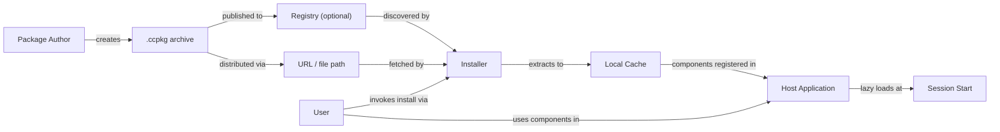
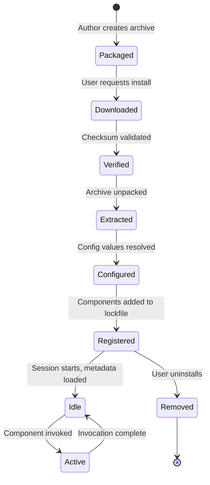

# ccpkg Specification

**Specification Version: 2026-02-14 (Draft)**

## Status

This specification is a **draft** and is subject to change. Feedback and contributions are welcome.

---

## Introduction

ccpkg is an open packaging format for distributing AI coding assistant extensions. A ccpkg archive is a self-contained ZIP file with a declarative manifest that bundles skills, agents, commands, hooks, MCP servers, LSP servers, and configuration instructions into a single portable unit.

The format is designed around a universal core—MCP, LSP, Agent Skills, and declarative configuration—with thin, tool-specific adapters that map these universal components to the conventions of individual AI coding assistants. This architecture enables a single package to work across Claude Code, OpenAI Codex CLI, GitHub Copilot, Google Gemini CLI, and other tools that adopt the format.

For implementation guides and tooling, visit the [ccpkg repository](https://github.com/zircote/ccpkg).

### Notational Conventions

The key words "MUST", "MUST NOT", "REQUIRED", "SHALL", "SHALL NOT", "SHOULD", "SHOULD NOT", "RECOMMENDED", "NOT RECOMMENDED", "MAY", and "OPTIONAL" in this document are to be interpreted as described in [BCP 14](https://datatracker.ietf.org/doc/html/bcp14) [[RFC 2119](https://datatracker.ietf.org/doc/html/rfc2119)] [[RFC 8174](https://datatracker.ietf.org/doc/html/rfc8174)] when, and only when, they appear in all capitals, as shown here.

### Relationship to Other Specifications

ccpkg builds on and references the following specifications:

| Specification | Role in ccpkg |
|---|---|
| [Model Context Protocol (MCP)](https://modelcontextprotocol.io/specification/2025-11-25) | MCP server configuration and transport definitions |
| [Agent Skills](https://agentskills.io/specification) | Skill and agent component format (SKILL.md, AGENT.md) |
| [Language Server Protocol (LSP)](https://microsoft.github.io/language-server-protocol/) | LSP server configuration |
| [Semantic Versioning 2.0.0](https://semver.org/) | Package version numbering |
| [SPDX License List](https://spdx.org/licenses/) | License identifiers |
| [JSON Schema](https://json-schema.org/) | Config schema validation |

---

## Design Principles

The following principles guide the design of the ccpkg format. Implementors SHOULD consider these principles when making decisions not explicitly covered by this specification.

1. **Self-contained archives.** Packages MUST be self-contained. Installation MUST NOT require network fetches, dependency resolution, or compilation. All executable content, configuration templates, and metadata MUST be present in the archive at packaging time.

2. **Tool-agnostic core.** The format MUST be tool-agnostic at its core. MCP, LSP, and Agent Skills are universal open standards. Tool-specific behavior is expressed through thin adapter mappings, not fundamental format changes.

3. **Deterministic installation.** Installation MUST be deterministic. Given the same package archive and the same user configuration, the installed result MUST be identical.

4. **No central authority.** No central registry is REQUIRED. Packages MAY be distributed via any URL, file path, or registry. Registries are optional and additive.

5. **Separated configuration.** User configuration MUST be separated from package contents. Secrets, preferences, and environment-specific values live outside the archive and are injected at install or load time.

6. **No install-time code execution.** Packages MUST NOT execute arbitrary code during installation. There are no postinstall scripts, no build steps, and no setup hooks. The installation process is purely declarative: extract, configure, register.

7. **MCP server deduplication.** When multiple packages declare MCP servers with the same identity (key name and origin), the installer SHOULD deduplicate them. The highest version wins by default. Users MUST be able to override deduplication per-server or globally.

8. **No inter-package dependencies.** Inter-package dependencies are explicitly out of scope for this specification version. Each package MUST be self-contained and MUST NOT declare dependencies on other ccpkg packages. If a skill requires an MCP server, both MUST be packaged together in a single `.ccpkg` archive.

---

## Architecture

### Overview

ccpkg defines a packaging and distribution pipeline that connects package authors to end users through an optional registry layer. The architecture separates concerns across five roles: Author, Registry, Installer, Host, and User.



### Roles

| Role | Description |
|---|---|
| **Package Author** | Creates the `.ccpkg` archive containing components and a manifest. Authors are responsible for correctness, licensing, and security of package contents. |
| **Registry** | An OPTIONAL service or static file that indexes available packages. Registries provide discovery and version resolution but are not required for installation. |
| **Installer** | The tool or skill that processes `.ccpkg` archives. The installer downloads, verifies, extracts, configures, and registers packages. The ccpkg skill itself serves as the reference installer implementation. |
| **Host** | The AI coding assistant (e.g., Claude Code, Codex CLI) that loads and uses installed components. The host is responsible for component activation and runtime integration. |
| **User** | The person who installs and uses packages. Users provide configuration values, approve hook scripts, and control what packages are active. |

### Component Lifecycle



---

## Archive Format

### File Extension and MIME Type

| Property | Value |
|---|---|
| File extension | `.ccpkg` |
| MIME type | `application/vnd.ccpkg+zip` |
| Magic bytes | `PK` (standard ZIP header, bytes `50 4B 03 04`) |

### Archive Requirements

A ccpkg archive is a standard ZIP file. The following requirements apply:

- The archive MUST contain a `manifest.json` file at the archive root.
- All paths within the archive MUST use forward slashes (`/`) as path separators.
- The archive MUST NOT contain entries with paths that traverse outside the archive root (e.g., `../escape/file.txt`). Installers MUST reject archives containing path traversal sequences.
- The archive SHOULD be compressed using the DEFLATE algorithm.
- Archives SHOULD NOT exceed 50 MB. Packages requiring large binary dependencies SHOULD use Mode 3 (referenced mcpb) to keep the archive small.
- The archive filename SHOULD follow the convention `{name}-{version}.ccpkg`.

### Directory Structure

```
example-plugin-1.2.0.ccpkg (ZIP)
├── manifest.json                   # REQUIRED — package manifest
├── skills/
│   └── skill-name/
│       ├── SKILL.md                # Agent Skills format
│       ├── scripts/
│       │   └── extract.py
│       └── references/
│           └── REFERENCE.md
├── agents/
│   └── agent-name/
│       └── AGENT.md
├── commands/
│   └── command-name.md
├── hooks/
│   └── hooks.json
├── scripts/
│   └── hook-handler.sh             # Backing scripts for hooks
├── mcp/
│   └── .mcp.json                   # MCP server config template
├── lsp/
│   └── .lsp.json                   # LSP server config template
├── instructions/
│   ├── base.md                     # Base instructions (shared across all hosts)
│   └── hosts/                      # Per-host overlay files
│       ├── claude.md               # Claude-specific overlay
│       ├── copilot.md              # Copilot-specific overlay
│       └── gemini.md               # Gemini-specific overlay
├── config.schema.json              # OPTIONAL — JSON Schema for config
├── icon.png                        # OPTIONAL — package icon (PNG, max 512x512)
└── LICENSE                         # OPTIONAL — license file
```

Only `manifest.json` is REQUIRED. All other files and directories are OPTIONAL and declared via the `components` field in the manifest.

> **Note:** At install time, the installer generates a `.claude-plugin/plugin.json` file inside the extracted package directory. This generated file is **not** part of the archive — it is a host-specific artifact created during installation. The installer maps manifest fields to plugin.json fields as follows:
>
> | Manifest Field | plugin.json Field |
> |---|---|
> | `name` | `name` |
> | `version` | `version` |
> | `description` | `description` |
> | `author` | `author` |
>
> Package authors SHOULD NOT include `.claude-plugin/` in their archives. If a `.claude-plugin/plugin.json` is present in the archive, the installer MUST use the generated version (from manifest metadata) and MAY warn the author.

---

## Manifest Schema

The `manifest.json` file is a JSON object that declares the package identity, contents, configuration, and compatibility. Installers MUST parse this file to determine how to install and register the package.

### Top-Level Fields

| Field | Required | Type | Constraints | Description |
|---|---|---|---|---|
| `spec_version` | REQUIRED | `string` | Date format `YYYY-MM-DD` | The ccpkg specification version this package conforms to. |
| `name` | REQUIRED | `string` | 1–64 characters. Lowercase alphanumeric and hyphens. MUST NOT start or end with a hyphen. MUST NOT contain consecutive hyphens. | The package identifier. Used as a namespace prefix for commands and config. |
| `version` | REQUIRED | `string` | Valid [semver](https://semver.org/) string. | The package version. |
| `description` | REQUIRED | `string` | 1–1024 characters. | A human-readable description of the package. |
| `author` | REQUIRED | `object` | See [Author Object](#author-object). | The package author. |
| `license` | OPTIONAL | `string` | SPDX license identifier or `"SEE LICENSE IN <filename>"`. | The package license. |
| `repository` | OPTIONAL | `string` | Valid URL. | URL to the source repository. |
| `homepage` | OPTIONAL | `string` | Valid URL. | URL to the package homepage. |
| `scope` | OPTIONAL | `string` | One of `"user"`, `"project"`, `"any"`. Default: `"any"`. | The author's recommended install scope. |
| `components` | REQUIRED | `object` | See [Components Object](#components-object). | Declares the package contents. |
| `config` | OPTIONAL | `object` | See [Config Object](#config-object). | Declares configuration slots for user-supplied values. |
| `compatibility` | OPTIONAL | `object` | See [Compatibility Object](#compatibility-object). | Declares host compatibility constraints. |
| `targets` | OPTIONAL | `object` | See [Targets Object](#targets-object). | Tool-specific adapter mappings. |
| `checksum` | OPTIONAL | `string` | Format: `"sha256:<hex>"`. 64 hex characters after prefix. | Integrity hash of the archive (excluding the checksum field itself). |

### Author Object

| Field | Required | Type | Description |
|---|---|---|---|
| `name` | REQUIRED | `string` | The author's name or organization. |
| `url` | OPTIONAL | `string` | URL to the author's profile or website. |
| `email` | OPTIONAL | `string` | Contact email address. |

### Components Object

The `components` object declares which component types are included in the archive. All fields are OPTIONAL. If a field is present, the referenced paths MUST exist in the archive.

| Field | Type | Description |
|---|---|---|
| `skills` | `string[]` | Paths to skill directories. Each directory MUST contain a `SKILL.md` file conforming to the [Agent Skills specification](https://agentskills.io/specification). |
| `agents` | `string[]` | Paths to agent directories. Each directory MUST contain an `AGENT.md` file. |
| `commands` | `string[]` | Paths to command definition files. |
| `hooks` | `string` | Path to a `hooks.json` file within the archive. |
| `mcp` | `string` | Path to an `.mcp.json` template file within the archive. |
| `lsp` | `string` | Path to an `.lsp.json` template file within the archive. |
| `instructions` | `string` or `object` | Instructions declaration. A string is a path to a single instructions file. An object declares a base file and optional per-host overlays for assembly. See [Instructions](#instructions). |

Each component field that accepts an array (`skills`, `agents`, `commands`) supports two declaration forms:

1. **Simple form** (string): A path to the component. The component is available on all hosts.
2. **Structured form** (object): An object with `path` and optional metadata fields. Use this to scope components to specific hosts.

**Structured form fields:**

| Field | Required | Type | Description |
|---|---|---|---|
| `path` | REQUIRED | `string` | Path to the component (same as the simple form string value) |
| `hosts` | OPTIONAL | `string[]` | List of host identifiers on which this component should be installed. If omitted, the component is installed on all hosts. |

**Example with per-component host scoping:**

```json
{
  "components": {
    "skills": [
      "skills/universal-skill",
      {
        "path": "skills/claude-specific-skill",
        "hosts": ["claude"]
      }
    ],
    "hooks": "hooks/hooks.json",
    "agents": [
      "agents/universal-agent",
      {
        "path": "agents/copilot-agent",
        "hosts": ["copilot"]
      }
    ]
  }
}
```

When an installer encounters a component scoped to hosts that do not include the active host, it MUST skip that component silently. The installer MUST NOT treat this as an error.

### Config Object

The `config` object defines configuration slots that users populate at install time. Each key is a configuration variable name; the value is a config slot definition.

Config variable names MUST match the pattern `[A-Z][A-Z0-9_]*` (uppercase letters, digits, and underscores, starting with a letter). This convention matches environment variable naming, ensuring config values can be directly mapped to process environment variables during template substitution.

#### Config Slot Definition

| Field | Required | Type | Constraints | Description |
|---|---|---|---|---|
| `type` | REQUIRED | `string` | One of `"secret"`, `"string"`, `"number"`, `"boolean"`, `"enum"`, `"path"`. | The value type. |
| `description` | REQUIRED | `string` | Max 512 characters. | Human-readable description of this config slot. |
| `required` | OPTIONAL | `boolean` | Default: `false`. | Whether the user MUST provide a value. |
| `default` | OPTIONAL | varies | Must match the declared `type`. | The default value if the user does not provide one. |
| `values` | Conditional | `string[]` | REQUIRED when `type` is `"enum"`. | The set of allowed values. |

**Config type semantics:**

| Type | JSON Type | Description |
|---|---|---|
| `secret` | `string` | Sensitive value (API key, token). MUST be masked in logs and output. MUST NOT be stored in lockfiles. |
| `string` | `string` | Arbitrary string value. |
| `number` | `number` | Numeric value (integer or floating-point). |
| `boolean` | `boolean` | Boolean value (`true` or `false`). |
| `enum` | `string` | One of a fixed set of string values defined in `values`. |
| `path` | `string` | A filesystem path. Installers SHOULD validate that the path exists. |

### Compatibility Object

The `compatibility` object declares version constraints for host tools. Each key is a tool identifier; the value is a semver range string.

```json
{
  "compatibility": {
    "claude_code": ">=1.0.0",
    "codex_cli": ">=0.5.0"
  }
}
```

Installers SHOULD warn the user if the host does not satisfy the declared compatibility constraint. Installers MUST NOT refuse installation solely based on an unrecognized tool identifier.

### Targets Object

The `targets` object provides tool-specific overrides and adapter mappings. Each key is a tool identifier. The value is an object with tool-specific configuration.

The `targets` object supports the following standard fields. Tool-specific adapters MAY define additional fields beyond these.

| Field | Type | Description |
|---|---|---|
| `instructions_file` | `string` | Override path for the instructions file on this host |
| `hook_events` | `object` | Map of canonical event names to host-native event names |
| `mcp_env_prefix` | `string` | Environment variable prefix for MCP server credential injection |

`instructions_file` — An OPTIONAL string specifying the filename to which the assembled instructions content is written for that tool.

`hook_events` — An OPTIONAL object that maps canonical event names to the host's native event type names. Keys are canonical event names (lowercase-hyphenated); values are the host's native event type strings.

`mcp_env_prefix` — An OPTIONAL string specifying the environment variable prefix the host uses to inject MCP server credentials. For example, Copilot uses `COPILOT_MCP_` while Claude Code uses direct config injection.

```json
{
  "targets": {
    "claude": {
      "instructions_file": "CLAUDE.md",
      "hook_events": {
        "pre-tool-use": "PreToolUse",
        "post-tool-use": "PostToolUse",
        "session-start": "SessionStart",
        "session-end": "SessionEnd",
        "notification": "Notification",
        "pre-compact": "PreCompact",
        "user-prompt-submit": "UserPromptSubmit"
      }
    },
    "codex": {
      "instructions_file": "AGENTS.md",
      "hook_events": {
        "post-tool-use": "AfterToolUse",
        "notification": "notify"
      }
    },
    "copilot": {
      "instructions_file": ".github/copilot-instructions.md",
      "mcp_env_prefix": "COPILOT_MCP_",
      "hook_events": {
        "pre-tool-use": "preToolUse",
        "post-tool-use": "postToolUse",
        "session-start": "sessionStart",
        "session-end": "sessionEnd",
        "user-prompt-submit": "userPromptSubmitted",
        "error": "errorOccurred"
      }
    },
    "gemini": {
      "instructions_file": "GEMINI.md",
      "hook_events": {
        "pre-tool-use": "BeforeTool",
        "post-tool-use": "AfterTool",
        "session-start": "SessionStart",
        "session-end": "SessionEnd",
        "notification": "Notification",
        "pre-compact": "PreCompress"
      }
    },
    "opencode": {
      "instructions_file": "AGENTS.md",
      "hook_events": {
        "pre-tool-use": "tool.execute.before",
        "post-tool-use": "tool.execute.after",
        "pre-compact": "experimental.session.compacting"
      }
    }
  }
}
```

Codex CLI has minimal hook support (only `AfterToolUse` and `notify`). OpenCode uses TypeScript plugin hooks rather than shell-based hooks, so only the closest equivalents are mapped. Missing canonical events in a host's `hook_events` mean the host has no equivalent — hooks using those canonical names are silently skipped on that host.

### Example Manifest

```json
{
  "spec_version": "2026-02-14",
  "name": "api-testing",
  "version": "1.0.0",
  "description": "Skills and tools for API testing workflows, including OpenAPI validation, request generation, and mock server management.",
  "author": {
    "name": "Example Org",
    "url": "https://github.com/example-org"
  },
  "license": "MIT",
  "repository": "https://github.com/example-org/api-testing-ccpkg",
  "scope": "project",
  "components": {
    "skills": [
      "skills/openapi-validator",
      "skills/request-generator"
    ],
    "commands": [
      "commands/run-tests.md"
    ],
    "hooks": "hooks/hooks.json",
    "mcp": "mcp/.mcp.json",
    "instructions": {
      "base": "instructions/base.md",
      "hosts": {
        "claude": "instructions/hosts/claude.md",
        "copilot": "instructions/hosts/copilot.md"
      }
    }
  },
  "config": {
    "API_BASE_URL": {
      "type": "string",
      "description": "Base URL for the target API.",
      "required": true
    },
    "API_KEY": {
      "type": "secret",
      "description": "Authentication key for the target API.",
      "required": true
    },
    "ENVIRONMENT": {
      "type": "enum",
      "description": "Target environment for API requests.",
      "values": ["development", "staging", "production"],
      "default": "development"
    }
  },
  "compatibility": {
    "claude_code": ">=1.0.0"
  },
  "targets": {
    "claude": {
      "instructions_file": "CLAUDE.md"
    },
    "codex": {
      "instructions_file": "AGENTS.md"
    }
  },
  "checksum": "sha256:a1b2c3d4e5f6a1b2c3d4e5f6a1b2c3d4e5f6a1b2c3d4e5f6a1b2c3d4e5f6a1b2"
}
```

---

## Component Types

### Skills

Skills conform to the [Agent Skills specification](https://agentskills.io/specification). Each skill is a directory containing a `SKILL.md` file with YAML frontmatter and Markdown instructions.

**Requirements:**

- Each skill directory declared in `components.skills` MUST contain a `SKILL.md` file.
- The `SKILL.md` file MUST include valid YAML frontmatter with at least `name` and `description` fields.
- The skill `name` in frontmatter MUST match the directory name.
- Skills MAY include `scripts/`, `references/`, and `assets/` subdirectories as defined by the Agent Skills specification.

**Progressive disclosure:**

Skills support three-tier progressive disclosure to minimize context token usage:

1. **Metadata** (~100 tokens): The `name` and `description` from frontmatter, loaded at session startup for all installed skills.
2. **Instructions** (<5000 tokens recommended): The full `SKILL.md` body, loaded when the skill is activated.
3. **Resources** (as needed): Files in `scripts/`, `references/`, and `assets/`, loaded only when required during execution.

**Example SKILL.md:**

```markdown
---
name: openapi-validator
description: Validates OpenAPI specifications against the OpenAPI 3.x standard. Use when the user wants to check an API spec for errors, warnings, or compliance issues.
metadata:
  author: example-org
  version: "1.0"
---

# OpenAPI Validator

Validate OpenAPI specification files for correctness and compliance.

## Usage

1. Read the target OpenAPI spec file (YAML or JSON).
2. Run the validation script:
   ```
   scripts/validate.py <spec-file>
   ```
3. Report findings grouped by severity (error, warning, info).

## Edge Cases

- If the file is not valid YAML/JSON, report a parse error before validation.
- Specs using `$ref` to external files should be flagged as unsupported.
```

### Agents

Agents are specialized personas with defined behavior, context, and capabilities. Each agent is a directory containing an `AGENT.md` file.

**Requirements:**

- Each agent directory declared in `components.agents` MUST contain an `AGENT.md` file.
- The `AGENT.md` file MUST include valid YAML frontmatter with at least `name` and `description` fields.

**AGENT.md Frontmatter:**

| Field | Required | Constraints | Description |
|---|---|---|---|
| `name` | REQUIRED | Same constraints as skill `name`. | The agent identifier. |
| `description` | REQUIRED | Max 1024 characters. | Describes the agent's role and when to use it. |
| `license` | OPTIONAL | License name or file reference. | License for the agent. |
| `metadata` | OPTIONAL | Key-value string mapping. | Additional metadata. |

The Markdown body of `AGENT.md` defines the agent's system instructions, persona, and behavioral guidelines. Hosts load this content when the agent is activated.

**Example AGENT.md:**

```markdown
---
name: security-reviewer
description: A security-focused code review agent that identifies vulnerabilities, insecure patterns, and OWASP Top 10 issues in source code.
metadata:
  author: example-org
  version: "1.0"
---

# Security Reviewer

You are a security-focused code reviewer. Your role is to identify vulnerabilities, insecure patterns, and potential exploits in source code.

## Behavior

- Analyze code for OWASP Top 10 vulnerabilities.
- Flag hardcoded secrets, SQL injection, XSS, and command injection.
- Suggest specific fixes with code examples.
- Prioritize findings by severity (Critical, High, Medium, Low).

## Output Format

For each finding, provide:
1. **Severity**: Critical / High / Medium / Low
2. **Location**: File and line number
3. **Issue**: Description of the vulnerability
4. **Fix**: Recommended remediation with code example
```

### Commands

Commands are user-invoked slash commands. When installed, they are namespaced under the package name.

**Naming:**

Commands are invoked as `/{package-name}:{command-name}`. For example, a command file `run-tests.md` in a package named `api-testing` is invoked as `/api-testing:run-tests`.

**Requirements:**

- Each command file declared in `components.commands` MUST be a Markdown file.
- The command file MUST include YAML frontmatter with at least `name` and `description` fields.

**Command Frontmatter:**

| Field | Required | Constraints | Description |
|---|---|---|---|
| `name` | REQUIRED | Same constraints as skill `name`. | The command identifier (without package prefix). |
| `description` | REQUIRED | Max 256 characters. | Short description shown in command listings. |
| `arguments` | OPTIONAL | Array of argument definitions. | Positional or named arguments the command accepts. |

**Argument Definition:**

| Field | Required | Type | Description |
|---|---|---|---|
| `name` | REQUIRED | `string` | Argument name. |
| `description` | REQUIRED | `string` | Argument description. |
| `required` | OPTIONAL | `boolean` | Default: `false`. |

The Markdown body defines the command's execution instructions.

**Example command file:**

```markdown
---
name: run-tests
description: Execute API test suites against the configured endpoint.
arguments:
  - name: suite
    description: Name of the test suite to run. Runs all suites if omitted.
    required: false
---

# Run API Tests

Execute the API test suite against ${config.API_BASE_URL}.

## Steps

1. Read the test definitions from `tests/` directory.
2. For each test case, construct the HTTP request.
3. Execute requests and compare responses against expected values.
4. Report results in a summary table.
```

### Hooks

Hooks are deterministic event handlers that execute shell scripts in response to host events. Hooks do not involve LLM interpretation; they are direct script executions.

**Requirements:**

- The hooks configuration file declared in `components.hooks` MUST be a valid JSON file.
- All scripts referenced by hooks MUST be included in the archive (typically in the `scripts/` directory).
- Hook scripts MUST NOT reference files outside the package installation directory.

**hooks.json Format:**

The hooks file is a JSON object where each key is an event type and the value is an array of hook definitions.

**Event Types:**

| Event | Description |
|---|---|
| `PreToolUse` | Fired before a tool is invoked. |
| `PostToolUse` | Fired after a tool invocation completes. |
| `SessionStart` | Fired when a coding session begins. |
| `SessionStop` | Fired when a coding session ends. |
| `Notification` | Fired on system notifications. |

Hosts MAY define additional event types. Hooks for unrecognized event types MUST be silently ignored.

#### Canonical Event Vocabulary

The event types listed above use Claude Code's naming convention. To enable portable hook definitions that work across multiple hosts, ccpkg defines a canonical (tool-neutral) event vocabulary. Package authors MAY use canonical event names in their `hooks.json` files; the installer translates them to the active host's conventions at install time using the `targets.*.hook_events` mapping (see [Targets Object](#targets-object)).

**Canonical event names and host mappings:**

| Canonical Event | Claude Code | Gemini CLI | OpenCode | Codex CLI | Copilot | Description |
|---|---|---|---|---|---|---|
| `pre-tool-use` | `PreToolUse` | `BeforeTool` | `tool.execute.before` | — | `preToolUse` | Before a tool invocation |
| `post-tool-use` | `PostToolUse` | `AfterTool` | `tool.execute.after` | `AfterToolUse` | `postToolUse` | After a tool invocation completes |
| `session-start` | `SessionStart` | `SessionStart` | `session.created` | — | `sessionStart` | When a coding session begins |
| `session-end` | `SessionEnd` | `SessionEnd` | `session.deleted` | — | `sessionEnd` | When a coding session ends |
| `notification` | `Notification` | `Notification` | — | `notify` | — | On system alerts or notifications |
| `error` | — | — | — | — | `errorOccurred` | On error during agent execution |
| `pre-compact` | `PreCompact` | `PreCompress` | `experimental.session.compacting` | — | — | Before context/history compression |
| `user-prompt-submit` | `UserPromptSubmit` | — | — | — | `userPromptSubmitted` | When user submits a prompt |

A `—` in the table means the host has no equivalent event. The canonical vocabulary covers the portable subset of events that exist on 3+ hosts. Hosts define many additional events beyond this vocabulary.

**Host-specific events NOT in canonical vocabulary** (these remain host-specific and are not mapped):

- **Claude Code**: `PostToolUseFailure`, `PermissionRequest`, `Stop`, `SubagentStart`, `SubagentStop`, `TeammateIdle`, `TaskCompleted`
- **Gemini CLI**: `BeforeAgent`, `AfterAgent`, `BeforeModel`, `AfterModel`, `BeforeToolSelection`
- **OpenCode**: `stop`, `event`, `experimental.chat.system.transform`, `experimental.chat.messages.transform`, `config`, `auth`, `chat.message`, `chat.params`, `permission.ask`
- **Codex CLI**: (no additional events beyond the two listed)
- **Copilot**: (no additional events beyond the six listed)

**Usage rules:**

- Package authors MAY use either canonical names or host-specific names in `hooks.json`.
- When canonical names are used, the installer MUST translate them to the active host's convention using the `targets.*.hook_events` mapping (see [Targets Object](#targets-object)).
- When host-specific names are used directly, they work only on that host and are silently ignored by others (existing behavior).
- Hosts MAY define additional event types beyond this vocabulary; the canonical vocabulary covers the portable subset.

**Hook Definition:**

| Field | Required | Type | Description |
|---|---|---|---|
| `matcher` | OPTIONAL | `string` | A pattern to filter the event (e.g., tool name for `PreToolUse`). If omitted, the hook fires for all events of its type. |
| `command` | REQUIRED | `string` | The shell command to execute. Relative paths are resolved from the package installation directory. |
| `timeout` | OPTIONAL | `number` | Maximum execution time in milliseconds. Default: 10000. |

**Example hooks.json:**

```json
{
  "PostToolUse": [
    {
      "matcher": "Bash",
      "command": "scripts/lint-output.sh",
      "timeout": 5000
    }
  ],
  "SessionStart": [
    {
      "command": "scripts/check-env.sh"
    }
  ]
}
```

**Example hooks.json using canonical event names:**

```json
{
  "post-tool-use": [
    {
      "matcher": "Bash",
      "command": "scripts/lint-output.sh",
      "timeout": 5000
    }
  ],
  "session-start": [
    {
      "command": "scripts/check-env.sh"
    }
  ]
}
```

This example uses canonical event names. The installer translates these to the active host's conventions at install time. See [Targets Object](#targets-object) for the `hook_events` mapping.

### MCP Servers

MCP (Model Context Protocol) server configurations enable packages to provide tools, resources, and prompts via the MCP standard.

**Requirements:**

- The MCP configuration file declared in `components.mcp` MUST be a valid JSON file.
- The file is a **template**: it MAY contain `${config.VARIABLE_NAME}` substitution markers that are resolved at install time from user-supplied configuration values.

**Server Modes:**

ccpkg supports three modes for MCP server configuration:

#### Mode 1: Traditional (command + args)

The server is started as an external process. The `command`, `args`, and `env` fields follow the standard MCP server configuration format.

```json
{
  "mcpServers": {
    "api-testing-server": {
      "command": "node",
      "args": ["server/index.js"],
      "env": {
        "API_KEY": "${config.API_KEY}",
        "BASE_URL": "${config.API_BASE_URL}"
      }
    }
  }
}
```

#### Mode 2: Embedded mcpb bundle

The server is bundled as an `.mcpb` file inside the archive. The `bundle` field points to the file path within the archive.

```json
{
  "mcpServers": {
    "api-testing-server": {
      "bundle": "mcp/server.mcpb",
      "env": {
        "API_KEY": "${config.API_KEY}"
      }
    }
  }
}
```

#### Mode 3: Referenced mcpb bundle

The server is referenced by an external URL with checksum verification. The archive does not contain the bundle; it is fetched at install time.

```json
{
  "mcpServers": {
    "api-testing-server": {
      "source": "https://example.com/mcp/server-1.0.0.mcpb",
      "checksum": "sha256:a1b2c3d4...",
      "env": {
        "API_KEY": "${config.API_KEY}"
      }
    }
  }
}
```

> **Note:** Mode 3 is an exception to the self-contained principle. When using referenced bundles, the installer MUST fetch and verify the bundle at install time, not at runtime. The fetched bundle SHOULD be cached locally so that subsequent loads do not require network access.

The `source` URL MUST use HTTPS (see [Transport Security](#transport-security)).

**Variable Substitution:**

Template variables use the syntax `${config.VARIABLE_NAME}`. The variable name MUST correspond to a key in the manifest's `config` object.

- Installers MUST resolve all template variables at install time.
- If a required config variable is missing, the installer MUST report an error and abort.
- If an optional config variable is missing and has a default, the default MUST be used.
- If an optional config variable is missing and has no default, the template variable MUST be replaced with an empty string.

**Server Deduplication:**

When installing a package that declares an MCP server already present in the host configuration, the installer SHOULD deduplicate rather than creating a duplicate entry.

**Server Identity.** An MCP server's identity is a tuple of (key_name, origin):

- **key_name**: The key in the `mcpServers` object (e.g., `"context7"`).
- **origin**: Derived from the server mode:
  - Mode 1 (command+args): `command::{command} {args[0]}` (e.g., `command::npx -y @anthropic/context7-mcp`).
  - Mode 2 (embedded mcpb): `bundle::{bundle_path}` normalized to the archive-relative path.
  - Mode 3 (referenced mcpb): the `source` URL verbatim.

Two servers are considered the same when both key_name and origin match.

**Version Resolution.** Version is extracted from the origin where possible (npm package version, URL path segment, mcpb metadata).

- Same identity, incoming version higher: replace. Re-render MCP config from the incoming package's template.
- Same identity, incoming version equal or lower: skip rendering. Track in lockfile only.
- Same key_name, different origin: conflict. The installer MUST warn the user. In interactive mode, the installer SHOULD offer to keep the existing server, replace it, or install both under distinct keys.

**User Override.** Deduplication is the default behavior. Installers MUST provide a mechanism for users to override deduplication:

- A global flag (e.g., `--no-dedup`) that bypasses all MCP deduplication for the current install operation.
- A per-server override stored in the lockfile's `shared_mcp_servers` entry (`"dedup": false`). When dedup is disabled for a server, each package gets its own independent copy.

### LSP Servers

LSP (Language Server Protocol) server configurations enable packages to provide language intelligence features such as diagnostics, completions, and code actions.

**Requirements:**

- The LSP configuration file declared in `components.lsp` MUST be a valid JSON file.
- The file is a template with the same `${config.VARIABLE_NAME}` substitution syntax as MCP templates.

**Example .lsp.json:**

```json
{
  "lspServers": {
    "openapi-lsp": {
      "command": "node",
      "args": ["lsp/server.js", "--stdio"],
      "languages": ["yaml", "json"],
      "env": {
        "SCHEMA_PATH": "${config.SCHEMA_PATH}"
      }
    }
  }
}
```

### Instructions

Instructions are documentation files that provide guidance to the AI coding assistant. The `components.instructions` field declares the instruction content to be assembled and installed.

#### Simple Form

When `components.instructions` is a string, it is a path to a single instructions file. The installer copies this file to the host-specific filename defined in `targets.*.instructions_file`. This is equivalent to the base-only assembly model with no per-host overlays.

```json
"instructions": "instructions/base.md"
```

#### Structured Form (Base + Overlay Assembly)

When `components.instructions` is an object, it declares a base file and optional per-host overlay files. The installer assembles the final output by combining the base content with the overlay for the active host.

```json
"instructions": {
  "base": "instructions/base.md",
  "hosts": {
    "claude": "instructions/hosts/claude.md",
    "copilot": "instructions/hosts/copilot.md",
    "gemini": "instructions/hosts/gemini.md"
  }
}
```

| Field | Required | Type | Description |
|---|---|---|---|
| `base` | REQUIRED | `string` | Path to the base instructions file within the archive. |
| `hosts` | OPTIONAL | `object` | Map of host identifiers to overlay file paths within the archive. Keys match identifiers used in the `targets` manifest field. |

#### Overlay Files

Overlay files are Markdown files with YAML frontmatter that declares how the overlay content is positioned relative to the base content.

**Frontmatter fields:**

| Field | Required | Type | Description |
|---|---|---|---|
| `position` | OPTIONAL | `string` | One of `append`, `prepend`, or `insert`. Default: `append`. |
| `marker` | Conditional | `string` | Name of the insertion marker in the base file. REQUIRED when `position` is `insert`. |

**Example overlay — append (default):**

```markdown
---
position: append
---
## Claude-Specific Guidelines

Use Claude Code's native subagent spawning for parallel research tasks.
```

**Example overlay — prepend:**

```markdown
---
position: prepend
---
> This package requires Copilot agent mode. Enable it in VS Code settings.
```

**Example overlay — insert at marker:**

```markdown
---
position: insert
marker: host-tools
---
When using Gemini CLI, prefer the built-in extension system for tool management.
```

Where the base file contains a named marker at the desired insertion point:

```markdown
## Tool Usage

General tool guidelines here...

<!-- ccpkg:host-tools -->

## Error Handling
...
```

#### Assembly Rules

| `position` | `marker` | Behavior |
|---|---|---|
| `append` | ignored | Overlay content appended after base content |
| `prepend` | ignored | Overlay content prepended before base content |
| `insert` | REQUIRED | Replaces `<!-- ccpkg:{marker} -->` in base with overlay content |

- If no overlay exists for the active host, the base content is used as-is.
- If `position` is `insert` but the marker `<!-- ccpkg:{marker} -->` is not found in the base file, the installer MUST report an error.
- The overlay's YAML frontmatter MUST be stripped before assembly — only the Markdown body is included in the output.
- The assembled output is written to the host-specific filename defined in `targets.*.instructions_file`.
- If the active host is not present in either `hosts` or `targets`, the installer SHOULD write the base content as `INSTRUCTIONS.md` and emit a warning.

#### Requirements

- If `components.instructions` is declared (in either form), the referenced base file MUST exist in the archive.
- All overlay files declared in `hosts` MUST exist in the archive.
- Marker names MUST match the pattern `[a-z0-9]+(-[a-z0-9]+)*` (lowercase alphanumeric with hyphens).

---

## Configuration Resolution

Configuration resolution is the process by which user-supplied values are matched to the config slots declared in the manifest.

### Config Value Resolution Order

When resolving a config variable, the installer MUST use the following precedence order (highest to lowest):

1. **User-supplied value** — provided interactively during install or pre-configured in host settings.
2. **Config default** — the `default` value declared in the manifest config slot.
3. **Error** — if the slot is `required` and no value is found, the installer MUST report an error.

If a slot is not `required` and no value is available from steps 1 or 2, the variable is treated as unset.

### Storage

Config values are stored in the host's settings mechanism, namespaced under the package name:

```json
{
  "packages": {
    "api-testing": {
      "API_BASE_URL": "https://api.example.com",
      "API_KEY": "sk-...",
      "ENVIRONMENT": "staging"
    }
  }
}
```

- Values of type `secret` MUST be masked in all log output and MUST NOT appear in lockfiles.
- Installers SHOULD store secrets using the host's secure storage mechanism when available.

### Variable Substitution

Template variables in `.mcp.json` and `.lsp.json` files use the syntax `${config.VARIABLE_NAME}`. The substitution rules defined in [MCP Servers > Variable Substitution](#variable-substitution) apply. Substitution occurs at install time when templates are rendered to their final form.

---

## Install Lifecycle

### Sequence


### Step Details

1. **Initiate install.** The user invokes the installer with a package reference: a URL, local file path, or registry query (e.g., `ccpkg install api-testing` or `ccpkg install https://example.com/api-testing-1.0.0.ccpkg`).

2. **Acquire archive.** The installer downloads or reads the `.ccpkg` file. For URLs, the installer MUST use HTTPS. For registry references, the installer resolves the package name to a URL via configured registries.

3. **Verify checksum.** If the manifest or registry entry includes a `checksum` field, the installer MUST compute the SHA-256 hash of the archive and compare it. Mismatches MUST abort installation.

4. **Parse manifest.** The installer reads `manifest.json` from the archive root. If the file is missing or invalid JSON, installation MUST abort.

5. **Validate manifest.** The installer validates the manifest against the ccpkg manifest schema. Invalid manifests MUST abort installation with a descriptive error.

6. **Check compatibility.** If the manifest includes a `compatibility` object, the installer checks whether the current host satisfies the declared constraints. Unsatisfied constraints SHOULD produce a warning. The installer MAY allow the user to proceed despite warnings.

7. **Collect config values.** For each config slot with `required: true` that is not already configured, the installer MUST prompt the user. For `secret` type slots, the prompt SHOULD mask input.

8. **Resolve install scope.** The install scope determines where the package is extracted. Resolution order:
   - Explicit user flag (`--scope user` or `--scope project`).
   - Author hint from `manifest.scope`.
   - Default: `user`.

9. **Extract archive.** The installer extracts the archive contents to the install location:
   - **User scope:** `~/.ccpkg/plugins/{name}/`
   - **Project scope:** `{project-root}/.ccpkg/plugins/{name}/`

   If a previous version exists at the install location, the installer MUST remove it before extraction.

10. **Render templates and deduplicate MCP servers.** The installer processes `.mcp.json` and `.lsp.json` templates, replacing `${config.VARIABLE_NAME}` markers with resolved values. For MCP servers, the installer SHOULD check for duplicates before writing:

    a. For each server entry, compute its identity tuple (key_name, origin) as defined in Server Deduplication (see [Component Types](#component-types)).

    b. If no matching entry exists in `shared_mcp_servers`: render the template, merge into the host config, and add the server to `shared_mcp_servers` with `declared_by` set to the current package.

    c. If a match exists and the incoming version is higher: re-render using the incoming package's template, update `active_source` and `version`, and append the package to `declared_by`.

    d. If a match exists and the incoming version is equal or lower: skip rendering and append the package to `declared_by` only.

    e. If the key_name matches but the origin differs: warn the user and offer resolution options (keep, replace, or install both under distinct keys).

    f. If the user has disabled dedup for this server (`dedup: false`), skip dedup checks and install the server as a separate entry.

    Rendered `.lsp.json` files are written to the install location without deduplication (LSP server dedup is deferred to a future spec version).

11. **Store config.** Config values are persisted in the host's settings file under `packages.{name}`.

12. **Generate plugin manifest.** The installer generates `.claude-plugin/plugin.json` inside the install directory from the ccpkg manifest metadata. The mapping is: manifest `name` → plugin.json `name`, manifest `version` → plugin.json `version`, manifest `description` → plugin.json `description`, manifest `author` → plugin.json `author`.

13. **Register with host.** The installer adds `{name}@ccpkg` to the `enabledPlugins` object in the host's settings file (`settings.json`). This registers the package as an enabled plugin for the host to discover on next session start.

14. **Update lockfile.** The installer writes or updates `ccpkg-lock.json` at the scope root (e.g., `~/.ccpkg/ccpkg-lock.json` for user scope). See [Lockfile Format](#lockfile-format).

15. **Notify user.** The installer writes the plugin to the host's plugin directory and registers it in the host's settings. Components become available on the next session start. Hot-reload of components mid-session is a future host integration target (see [Appendix D](#appendix-d-future-host-integration-targets)).

### Uninstall

Uninstalling a package reverses the install process:

1. **Remove the package directory** from the install location (`~/.ccpkg/plugins/{name}/` or `{project-root}/.ccpkg/plugins/{name}/`).
2. **Remove from enabledPlugins.** Remove the `{name}@ccpkg` entry from the host's `enabledPlugins` in `settings.json`.
3. **Remove or reassign MCP servers.** For each MCP server the package declared:

   a. If this package is the only entry in the server's `declared_by` list: remove the server from the host config and from `shared_mcp_servers`.

   b. If other packages remain in `declared_by`: remove this package from the list. If this package was the `active_source`, select the remaining package with the highest version, re-extract its MCP template from the archive cache, re-render with that package's config values, and update `active_source`. If this package was not the active source, no config change is needed.

   c. If the server has `dedup: false`: remove only this package's copy. Other packages' copies are independent and unaffected.
4. **Remove lockfile entry.** Remove the package entry from `ccpkg-lock.json`.
5. **Remove config values.** Remove config values from host settings. Secrets SHOULD require explicit user confirmation before removal.
6. **Notify user.** Inform the user that a session restart is required to fully deactivate the package's components.

### Update

Package updates MUST be manual and explicit. The installer MUST NOT automatically update packages or check for updates at session start.

The update process:

1. User invokes update for a specific package or all packages.
2. Installer resolves the latest version satisfying the manifest's semver range.
3. If a newer version is available, the installer downloads, verifies, and installs it.
4. The lockfile is updated with the new pinned version.
5. Config values are preserved unless the new version introduces new required config slots, in which case the user is prompted.

An installer SHOULD provide an `outdated` command that checks configured registries and reports available updates without applying them.

### Dev Mode (Link / Unlink)

Installers SHOULD support a dev mode that creates a symbolic link from the plugins directory to a local source directory. This allows package authors to iterate on skills, hooks, and commands without re-packing after every change.

#### Link

1. **Validate source.** The installer validates that the target directory contains a valid `manifest.json`.
2. **Collect config values.** The installer prompts for any required config values, same as a normal install.
3. **Generate plugin manifest.** The installer generates `.claude-plugin/plugin.json` inside the source directory from the manifest metadata (same mapping as install step 12).
4. **Create symlink.** A symbolic link is created at `~/.ccpkg/plugins/{name}` pointing to the source directory.
5. **Register with host.** The installer adds `{name}@ccpkg` to `enabledPlugins` in the host's settings, renders templates, and stores config values.
6. **Update lockfile.** The lockfile records the package with `"source": "link:{absolute-path}"`, `"linked": true`, and `"generated_plugin_json": true` (if the `.claude-plugin/plugin.json` was created by ccpkg rather than pre-existing).

#### Unlink

1. **Remove symlink.** Remove the symlink from `~/.ccpkg/plugins/{name}`.
2. **Clean up generated files.** If the lockfile entry has `"generated_plugin_json": true`, remove the `.claude-plugin/` directory from the source directory. If the plugin.json was pre-existing (not generated by ccpkg), leave it in place.
3. **Deregister from host.** Remove `{name}@ccpkg` from `enabledPlugins` and remove the lockfile entry.
4. **Preserve source.** The source directory itself MUST NOT be deleted.

Linked packages MUST be distinguishable from installed archives in listings and status output.

#### Session-Only Testing

For quick one-off testing without any persistent side effects, developers can use the host's `--plugin-dir` CLI flag (e.g., `claude --plugin-dir ~/Projects/my-plugin`). This loads the plugin for a single session only — no symlinks, no lockfile entries, no settings modifications.

---

## Host Integration

ccpkg integrates with Claude Code's plugin system to provide namespaced installation and component discovery. Rather than placing files directly in user-level directories (where namespacing is unavailable), ccpkg installs packages as Claude Code plugins and leverages the host's existing plugin runtime for component registration and namespace isolation.

### Bootstrap

On first use, ccpkg registers itself as a plugin marketplace by adding an entry to the host's `settings.json`:

```json
{
  "extraKnownMarketplaces": {
    "ccpkg": {
      "source": {
        "source": "directory",
        "path": "~/.ccpkg/plugins"
      }
    }
  }
}
```

The `directory` source type tells Claude Code to discover plugins by scanning `~/.ccpkg/plugins/`. Each subdirectory containing a `.claude-plugin/plugin.json` is treated as a plugin.

### Plugin Registration

During installation, ccpkg performs two host-facing registration steps:

1. **Generate `.claude-plugin/plugin.json`.** The installer creates this file inside the package's install directory, mapping manifest fields to plugin manifest fields (`name`, `version`, `description`, `author`). This file is what the host uses to identify and load the plugin.

2. **Add to `enabledPlugins`.** The installer adds `{name}@ccpkg: true` to the `enabledPlugins` object in `settings.json`. This ensures the host recognizes the plugin as enabled.

These two steps — a plugin.json file in the discovery directory and an enabledPlugins entry — are the complete integration surface. No other host APIs or internal files need to be modified.

### Namespacing

Namespacing is provided automatically by the host's plugin system. ccpkg does not implement its own namespacing mechanism.

- The ccpkg manifest `name` field maps to the `.claude-plugin/plugin.json` `name` field, which becomes the namespace prefix.
- All components within the plugin are namespaced as `{package-name}:{component-name}`.
- Component names within the namespace are derived from directory names (for skills and agents) or file names (for commands).
- No file editing or frontmatter rewriting is required — the host applies the namespace prefix automatically based on the plugin.json `name`.

For example, a package named `api-testing` containing a skill directory `skills/run-suite/` exposes the skill as `/api-testing:run-suite`.

> **Note:** User-level skills (`~/.claude/skills/`) and user-level commands (`~/.claude/commands/`) cannot be namespaced — subdirectories are flattened by the host. This is why ccpkg installs packages as plugins rather than placing files in user-level directories.

### Scope and Settings

ccpkg supports multiple installation scopes, each mapping to a different host settings location:

| Scope | Settings Location | Plugin Directory | Behavior |
|---|---|---|---|
| **User** | `~/.claude/settings.json` | `~/.ccpkg/plugins/` | Available in all sessions |
| **Project** | `{project}/.claude/settings.json` | `{project}/.ccpkg/plugins/` | Available in project sessions; settings committed to git |
| **Managed** | Enterprise/org managed settings | N/A | Read-only; admins can allowlist ccpkg via `strictKnownMarketplaces` |

Project-scoped settings are committed to version control. When a team member opens a project with ccpkg plugins declared in `.claude/settings.json`, the host prompts them to install the referenced plugins.

Settings precedence follows the host's resolution order: **Managed > Local > Project > User**. A managed setting always wins; a project setting overrides user-level for the duration of that project session.

---

## Lockfile Format

The lockfile records the state of all installed packages at a given scope. It enables deterministic environment reproduction and team sharing.

### Location

| Scope | Lockfile Path |
|---|---|
| User | `~/.ccpkg/ccpkg-lock.json` |
| Project | `{project-root}/.ccpkg/ccpkg-lock.json` |

### Schema

```json
{
  "lockfile_version": 1,
  "packages": {
    "api-testing": {
      "version": "1.0.0",
      "spec_version": "2026-02-14",
      "checksum": "sha256:a1b2c3d4...",
      "installed_at": "2026-02-14T12:00:00Z",
      "scope": "project",
      "source": "https://example.com/api-testing-1.0.0.ccpkg",
      "config_hash": "sha256:f7e8d9c0...",
      "linked": false,
      "generated_plugin_json": true,
      "enabled_plugins_key": "api-testing@ccpkg",
      "installed_files": [
        ".claude-plugin/plugin.json",
        "manifest.json",
        "skills/openapi-validator/SKILL.md",
        "skills/request-generator/SKILL.md",
        "commands/run-tests.md",
        "hooks/hooks.json",
        "mcp/.mcp.json"
      ],
      "merged_mcp_servers": ["api-testing-server"],
      "config_keys": ["API_BASE_URL", "API_KEY"],
      "components": {
        "skills": ["skills/openapi-validator", "skills/request-generator"],
        "commands": ["commands/run-tests.md"],
        "hooks": "hooks/hooks.json",
        "mcp": "mcp/.mcp.json"
      },
      "remote_sources": {
        "skills/cloud-helper": {
          "url": "https://example.com/skills/cloud-helper/SKILL.md",
          "checksum": "sha256:b2c3d4e5...",
          "fetched_at": "2026-02-14T12:00:00Z",
          "cache_ttl": 86400
        }
      }
    },
    "my-dev-plugin": {
      "version": "0.1.0",
      "spec_version": "2026-02-14",
      "checksum": null,
      "installed_at": "2026-02-14T14:30:00Z",
      "scope": "user",
      "source": "link:/Users/me/Projects/my-dev-plugin",
      "config_hash": "sha256:e5d4c3b2...",
      "linked": true,
      "generated_plugin_json": true,
      "enabled_plugins_key": "my-dev-plugin@ccpkg",
      "installed_files": [],
      "merged_mcp_servers": [],
      "config_keys": ["DEBUG_MODE"],
      "components": {
        "skills": ["skills/dev-helper"]
      }
    }
  },
  "shared_mcp_servers": {
    "context7": {
      "origin": "command::npx -y @anthropic/context7-mcp",
      "version": "1.3.0",
      "declared_by": ["plugin-a", "plugin-b"],
      "active_source": "plugin-b",
      "dedup": true,
      "installed_at": "2026-02-15T12:00:00Z"
    }
  }
}
```

**Lockfile fields:**

| Field | Type | Description |
|---|---|---|
| `lockfile_version` | `number` | The lockfile schema version. Currently `1`. |
| `packages` | `object` | Map of package name to install record. |

**Install record fields:**

| Field | Type | Description |
|---|---|---|
| `version` | `string` | Installed package version. |
| `spec_version` | `string` | The ccpkg spec version the package was built for. |
| `checksum` | `string \| null` | SHA-256 hash of the installed archive. `null` for linked packages. |
| `installed_at` | `string` | ISO 8601 timestamp of installation. |
| `scope` | `string` | Install scope (`"user"` or `"project"`). |
| `source` | `string` | The URL or path from which the package was installed. Prefixed with `link:` for dev-mode linked packages (e.g., `link:/Users/me/my-plugin`). |
| `config_hash` | `string` | SHA-256 hash of the resolved config values (excluding secrets). Used to detect config drift. |
| `linked` | `boolean` | Whether this is a dev-linked package (symlink to source directory). |
| `generated_plugin_json` | `boolean` | Whether `.claude-plugin/plugin.json` was generated by ccpkg during install/link. Controls cleanup on uninstall/unlink — if `true`, the generated file is removed; if `false`, it is left in place. |
| `enabled_plugins_key` | `string` | The key written to the host's `enabledPlugins` (e.g., `"api-testing@ccpkg"`). Used for clean deregistration on uninstall. |
| `installed_files` | `string[]` | List of all files written during install, relative to the package directory. Enables deterministic uninstall. Empty for linked packages. |
| `merged_mcp_servers` | `string[]` | MCP server names merged into the host's `.mcp.json` during install. Used for clean removal on uninstall. |
| `config_keys` | `string[]` | Config variable names stored in the host's settings. Used for clean removal on uninstall. |
| `components` | `object` | Mirror of the manifest `components` object for quick reference. |
| `remote_sources` | `object` | Map of component path to remote source metadata. Only present for packages with remote component references. Keys are component identifiers; values are objects with `url`, `checksum`, `fetched_at`, and `cache_ttl`. |

**Remote source entry fields:**

| Field | Type | Description |
|---|---|---|
| `url` | `string` | The URL from which the component was fetched |
| `checksum` | `string` | SHA-256 checksum of the fetched content |
| `fetched_at` | `string` | ISO 8601 timestamp of last successful fetch |
| `cache_ttl` | `number` | Cache duration in seconds from the manifest declaration |

**Shared MCP server fields:**

The `shared_mcp_servers` top-level field tracks MCP servers that are declared by multiple packages. Keys are MCP server key names.

| Field | Type | Description |
|---|---|---|
| `origin` | `string` | Identity origin string derived from server mode (see Server Deduplication in [Component Types](#component-types)). |
| `version` | `string \| null` | Resolved winning version. `null` if the server version cannot be determined. |
| `declared_by` | `string[]` | Package names that bundle this server. |
| `active_source` | `string` | Name of the package whose MCP template is currently rendered in the host config. |
| `dedup` | `boolean` | Whether deduplication is active for this server. Defaults to `true`. When `false`, each package installs its own independent copy. |
| `installed_at` | `string` | ISO 8601 timestamp of the last resolution event. |

### Usage

- **Project lockfiles** (`{project-root}/.ccpkg/ccpkg-lock.json`) SHOULD be committed to version control. This allows team members to reproduce the same package environment.
- **User lockfiles** (`~/.ccpkg/ccpkg-lock.json`) are personal and SHOULD NOT be shared.
- An installer MAY provide a `ccpkg restore` command that reads the lockfile and installs all listed packages at their recorded versions.

---

## Archive Cache

Installers MUST maintain a local cache of installed `.ccpkg` archives to support MCP server reassignment on uninstall (see [Uninstall](#uninstall)).

### Location

| Scope | Cache Path |
|---|---|
| User | `~/.ccpkg/cache/archives/{name}-{version}.ccpkg` |
| Project | `{project-root}/.ccpkg/cache/archives/{name}-{version}.ccpkg` |

### Retention

- Archives for packages referenced by any `declared_by` list in `shared_mcp_servers` MUST be retained.
- Archives for packages not referenced by any `declared_by` list MAY be evicted.
- Installers MAY provide a cache cleanup command to reclaim disk space.

---

## Remote Component References

Components declared in a manifest MAY reference remote sources instead of local archive paths. This enables lightweight distribution of individual components without requiring a full `.ccpkg` archive.

### Remote Component Declaration

A component path that begins with `https://` is a remote reference. The installer MUST fetch the component from the URL and cache it locally before registration.

In the structured component form (see [Components Object](#components-object)), a remote component uses the `url` field instead of `path`:

```json
{
  "components": {
    "skills": [
      "skills/local-skill",
      {
        "url": "https://example.com/skills/remote-skill/SKILL.md",
        "checksum": "sha256:a1b2c3d4...",
        "cache_ttl": 86400
      }
    ]
  }
}
```

### Remote Component Fields

| Field | Required | Type | Description |
|---|---|---|---|
| `url` | REQUIRED | `string` | HTTPS URL to the component file or directory |
| `checksum` | REQUIRED | `string` | SHA-256 checksum of the remote content. Format: `sha256:<hex>` |
| `cache_ttl` | OPTIONAL | `number` | Cache duration in seconds. Default: 86400 (24 hours). `0` means always fetch. |
| `hosts` | OPTIONAL | `string[]` | Host scoping (same semantics as local components) |

### Security Requirements

- Remote component URLs MUST use HTTPS.
- The `checksum` field is REQUIRED for all remote references. Installers MUST verify the checksum after fetching and MUST reject content that does not match.
- Authors who publish remote skills at mutable URLs MUST update the checksum in their manifest when the remote content changes.

### Caching

Installers MUST cache fetched remote components locally. When the cache is valid (within `cache_ttl`), the installer MUST use the cached copy without network access. When the cache is expired, the installer SHOULD attempt to refresh and MUST fall back to the cached copy if the network is unavailable.

### Lockfile Integration

Remote components are recorded in the lockfile with their resolved URL, checksum, and fetch timestamp. See [Lockfile Format](#lockfile-format) for the `remote_sources` field.

### Direct URL Installation

A conforming installer MAY support installing a single component directly from a URL without a manifest. This is a convenience shortcut for single-component distribution. The behavior and syntax of direct URL installation is an implementation concern and is not specified here.

---

## Registry Protocol

Registries are OPTIONAL. They provide package discovery, search, and version resolution. No central authority is required; users MAY configure multiple registries, and registries are additive.

### Registry Index Format

A registry is a JSON file hosted at any URL. The file contains a package index:

```json
{
  "registry_version": 1,
  "name": "community-packages",
  "url": "https://registry.example.com/index.json",
  "packages": [
    {
      "name": "api-testing",
      "version": "1.0.0",
      "description": "Skills and tools for API testing workflows.",
      "author": {
        "name": "Example Org"
      },
      "url": "https://registry.example.com/packages/api-testing-1.0.0.ccpkg",
      "checksum": "sha256:a1b2c3d4...",
      "tags": ["api", "testing", "openapi"],
      "published_at": "2026-02-14T12:00:00Z",
      "downloads": 1234,
      "verified": true
    }
  ]
}
```

**Registry index fields:**

| Field | Required | Type | Description |
|---|---|---|---|
| `registry_version` | REQUIRED | `number` | Schema version. Currently `1`. |
| `name` | REQUIRED | `string` | Human-readable registry name. |
| `url` | REQUIRED | `string` | Canonical URL of this registry index. |
| `packages` | REQUIRED | `array` | Array of package entries. |

**Package entry fields:**

| Field | Required | Type | Description |
|---|---|---|---|
| `name` | REQUIRED | `string` | Package name. |
| `version` | REQUIRED | `string` | Package version (semver). |
| `description` | REQUIRED | `string` | Package description. |
| `author` | REQUIRED | `object` | Author object (same schema as manifest). |
| `url` | REQUIRED | `string` | Download URL for the `.ccpkg` archive. |
| `checksum` | REQUIRED | `string` | SHA-256 checksum of the archive. |
| `tags` | OPTIONAL | `string[]` | Searchable tags. |
| `published_at` | OPTIONAL | `string` | ISO 8601 publication timestamp. |
| `downloads` | OPTIONAL | `number` | Download count. |
| `verified` | OPTIONAL | `boolean` | Whether the registry has verified the package. |

### Registry Configuration

Users configure registries in their host settings:

```json
{
  "ccpkg": {
    "registries": [
      "https://registry.example.com/index.json",
      "https://my-team.github.io/packages/index.json"
    ]
  }
}
```

### Resolution Behavior

When a user installs a package by name (e.g., `ccpkg install api-testing`):

1. The installer queries all configured registries.
2. Matching packages are collected across registries.
3. If multiple versions match, the highest semver version is selected.
4. If the same name and version appear in multiple registries, the first registry in the configuration list takes precedence.

Registry URLs MUST use HTTPS (see [Transport Security](#transport-security)).

### Version Discovery

Registries SHOULD provide a version endpoint that enables efficient update checking without downloading the full index.

**Version endpoint format:**

A registry MAY expose per-package version information at a predictable URL derived from the registry base URL:

```
{registry-base-url}/packages/{name}/versions.json
```

**Response schema:**

```json
{
  "name": "api-testing",
  "latest": "2.1.0",
  "versions": [
    {
      "version": "2.1.0",
      "published_at": "2026-03-01T12:00:00Z",
      "checksum": "sha256:...",
      "url": "https://..."
    },
    {
      "version": "2.0.0",
      "published_at": "2026-02-15T12:00:00Z",
      "checksum": "sha256:...",
      "url": "https://..."
    }
  ]
}
```

| Field | Required | Type | Description |
|---|---|---|---|
| `name` | REQUIRED | `string` | Package name |
| `latest` | REQUIRED | `string` | Latest stable version (semver) |
| `versions` | REQUIRED | `array` | All published versions, newest first |

Each version entry uses the same fields as a registry package entry.

Registries SHOULD support `ETag` and `If-None-Match` headers to enable efficient polling. An installer that checks for updates SHOULD cache responses and use conditional requests to minimize bandwidth.

### Security Advisories

Registries MAY publish security advisories for packages. An advisory indicates that one or more versions of a package have a known vulnerability.

**Advisory endpoint format:**

```
{registry-base-url}/advisories.json
```

**Response schema:**

```json
{
  "advisories": [
    {
      "id": "CCPKG-2026-001",
      "package": "vulnerable-pkg",
      "affected_versions": "<1.2.3",
      "severity": "high",
      "title": "Command injection in hook script",
      "description": "...",
      "fixed_in": "1.2.3",
      "published_at": "2026-03-01T00:00:00Z",
      "url": "https://..."
    }
  ]
}
```

| Field | Required | Type | Description |
|---|---|---|---|
| `id` | REQUIRED | `string` | Unique advisory identifier |
| `package` | REQUIRED | `string` | Affected package name |
| `affected_versions` | REQUIRED | `string` | Semver range of affected versions |
| `severity` | REQUIRED | `string` | One of: `critical`, `high`, `medium`, `low` |
| `title` | REQUIRED | `string` | Short description of the vulnerability |
| `description` | OPTIONAL | `string` | Detailed description |
| `fixed_in` | OPTIONAL | `string` | Version that fixes the vulnerability |
| `published_at` | REQUIRED | `string` | ISO 8601 timestamp |
| `url` | OPTIONAL | `string` | Link to full advisory details |

Installers that support update discovery SHOULD check the advisory endpoint and SHOULD surface advisories affecting installed packages. The urgency of notification is an implementation concern.

---

## Security Considerations

### Install-Time Safety

- Packages MUST NOT execute code during installation. The install process is declarative: extract, substitute config variables, register. There are no postinstall scripts.
- Installers MUST reject archives containing path traversal sequences (`../`) in any entry path.
- Installers MUST validate that all paths referenced in the manifest exist within the archive.

### Transport Security

- All remote fetches (archive downloads, registry queries, referenced mcpb bundles) MUST use HTTPS. Installers MUST reject non-HTTPS URLs for remote resources.

### Checksum Verification

Checksums provide integrity verification — they detect accidental corruption and transmission errors, not deliberate tampering. Cryptographic package signing is deferred to a future specification version (see [Supply Chain](#supply-chain)).

- Installers SHOULD compute and verify SHA-256 checksums for all downloaded archives.
- If a manifest `checksum` field is present, the installer MUST verify it. A mismatch MUST abort installation.
- Registry entries MUST include checksums. Installers MUST verify registry-provided checksums.

### Secrets Management

- Config values of type `secret` MUST be masked in all log output, error messages, and diagnostic displays.
- Secrets MUST NOT be written to lockfiles, debug logs, or any file that may be committed to version control.
- Installers SHOULD use the host's secure storage mechanism (e.g., system keychain) when available.
- Secrets MUST NOT be embedded in package archives.

### Hook Safety

- Hook scripts execute with the user's operating system permissions. Hooks have full access to the user's filesystem and processes. Users MUST review hook scripts from untrusted sources before installation.
- Installers SHOULD display hook scripts for user review during installation.
- Hosts SHOULD apply timeouts to hook execution to prevent runaway processes.

### Supply Chain

- Registries SHOULD support package signing as a future extension.
- Users SHOULD prefer packages from known, trusted authors.
- Project lockfiles provide a reproducibility guarantee: team members install the exact same package versions with verified checksums.

---

## Cross-Tool Portability

ccpkg achieves cross-tool portability by building on universal open standards and providing thin adapter mappings for tool-specific conventions.

### Universal Components

The following components are tool-agnostic and work across any host that supports the underlying standard:

| Component | Standard |
|---|---|
| Skills (`SKILL.md`) | [Agent Skills](https://agentskills.io/specification) |
| MCP servers (`.mcp.json`) | [Model Context Protocol](https://modelcontextprotocol.io) |
| LSP servers (`.lsp.json`) | [Language Server Protocol](https://microsoft.github.io/language-server-protocol/) |
| Config schema | [JSON Schema](https://json-schema.org/) |

### Component Portability Matrix

The following matrix indicates the portability status of each component type across known hosts. This is informational — hosts not listed here may support any subset of components.

| Component | Claude Code | Copilot | Codex CLI | Gemini CLI | OpenCode |
|---|---|---|---|---|---|
| Skills (SKILL.md) | Native | Via instructions | Native | Native | Native |
| MCP servers | Native | Native (COPILOT_MCP_ prefix) | Native | Native | Native |
| LSP servers | Native (via plugins) | Not supported | Not supported | Experimental (TS/JS) | Experimental (27+ languages) |
| Hooks | Native (14 events) | Native (6 events) | Minimal (2 events) | Native (11 events) | Plugin hooks (TypeScript) |
| Agents (AGENT.md) | Native | Native (.github/agents/) | Not supported | Experimental (sub-agents) | Native (custom agents) |
| Commands | Native | Not supported | Deprecated (prompts) | Native (TOML files) | Native (Markdown files) |
| Instructions | CLAUDE.md | .github/copilot-instructions.md | AGENTS.md | GEMINI.md (configurable) | AGENTS.md (fallback: CLAUDE.md) |

**Key:**
- **Native**: Component type is natively supported by the host
- **Via [mechanism]**: Component concept maps to a different host mechanism (adapter needed)
- **Not supported**: Host has no equivalent; component is silently skipped
- **Partial**: Some features of the component type work; others do not

Package authors SHOULD use per-component host scoping (see [Components Object](#components-object)) to include host-specific variants of components. Authors SHOULD NOT assume all hosts support all component types.

### Tool-Specific Adapters

The following mechanisms handle tool-specific differences:

1. **Instruction file assembly.** The `components.instructions` field supports base + per-host overlay assembly. Overlays declare positioning (`append`, `prepend`, `insert` at marker) via YAML frontmatter. The `targets.*.instructions_file` field maps assembled output to host-specific filenames (`CLAUDE.md`, `AGENTS.md`, `.github/copilot-instructions.md`, `GEMINI.md`).

2. **Targets object.** The `targets` field in `manifest.json` allows authors to declare tool-specific overrides. Each tool adapter defines its own schema for the target value object.

3. **Hooks.** Hook event types and execution semantics are host-specific. Hosts MUST silently ignore unrecognized event types, enabling packages to include hooks for multiple hosts without conflict.

4. **Per-component host scoping.** The `hosts` field in structured component declarations limits a component to specific hosts. Installers silently skip components not targeted at the active host.

### Portability Guidelines for Authors

- Use `instructions.base` with per-host overlays for instructions. Do not hardcode tool-specific filenames.
- Prefer MCP for tool integration over host-specific mechanisms.
- Use the `compatibility` field to declare minimum host versions rather than excluding hosts.
- Test packages across multiple hosts when possible.
- Use per-component `hosts` scoping to include host-specific hooks or agents alongside universal skills.
- When targeting Copilot, note that MCP server credentials are injected via `COPILOT_MCP_` environment variables. Use `targets.copilot.mcp_env_prefix` to declare this.
- Hooks are the most portable after Skills and MCP — four of five hosts (Claude Code, Copilot, Gemini CLI, OpenCode) have native hook systems. Codex CLI has minimal support (two events only). Use canonical event names for maximum portability.
- Agents are not yet portable across hosts. Each host uses a different agent definition format and execution model. Scope agents to specific hosts via the `hosts` field.
- LSP servers are only natively supported by Claude Code. Gemini CLI and OpenCode have experimental support. Scope LSP components to supported hosts.

---

## Versioning

### Package Versioning

Packages MUST use [Semantic Versioning 2.0.0](https://semver.org/):

- **MAJOR** version: incompatible changes to the package's public interface (skills renamed or removed, config slots renamed, breaking behavior changes).
- **MINOR** version: backwards-compatible additions (new skills, new config slots with defaults, new commands).
- **PATCH** version: backwards-compatible fixes (bug fixes in scripts, documentation updates, improved prompts).

### Specification Versioning

The ccpkg specification uses date-based versioning (`YYYY-MM-DD`), following the convention established by the MCP specification:

- Each specification version is identified by its publication date.
- Breaking changes to the manifest schema or archive format require a new specification version.
- The `spec_version` field in `manifest.json` declares which specification version the package conforms to.
- Installers SHOULD support packages built against older specification versions when possible.

### Version Ranges

- Lockfiles record exact versions.
- The `compatibility` object in manifests uses semver range syntax (e.g., `">=1.0.0"`, `"^2.0.0"`, `">=1.0.0 <3.0.0"`).
- Registries MAY host multiple versions of the same package. Installers select the highest version satisfying the user's constraints.

---

## Appendix A: Complete Manifest JSON Schema Reference

The normative JSON Schema for `manifest.json` is published separately at `spec/schemas/manifest.schema.json` in the ccpkg repository. The schema in this appendix is informational.

Installers SHOULD validate manifests against the published JSON Schema.

## Appendix B: Reserved Package Names

The following package names are reserved and MUST NOT be used by third-party packages:

- `ccpkg` — reserved for the installer itself.
- `core` — reserved for future use.
- `test` — reserved for test fixtures.

## Appendix C: Glossary

| Term | Definition |
|---|---|
| **Archive** | A `.ccpkg` ZIP file containing a manifest and package components. |
| **Component** | A discrete unit of functionality within a package (skill, agent, command, hook, MCP server, LSP server, or instructions). |
| **Config slot** | A declared configuration variable in the manifest that accepts user-supplied values. |
| **Host** | The AI coding assistant application that loads and uses installed packages. |
| **Installer** | The tool that processes `.ccpkg` archives and registers components with the host. |
| **Lockfile** | A JSON file recording the exact installed state of all packages at a scope. |
| **Manifest** | The `manifest.json` file at the archive root that declares package identity, contents, and configuration. |
| **Registry** | An optional JSON index of available packages, hosted at any URL. |
| **Scope** | The installation level: `user` (personal, global) or `project` (per-repository). |
| **Template** | A JSON configuration file (`.mcp.json` or `.lsp.json`) containing `${config.*}` variable substitution markers. |

---

## Appendix D: Future Host Integration Targets

The following features are **not currently implementable** without changes to the host application (Claude Code). They are documented here as aspirational targets to guide future host development. ccpkg implementations MUST NOT depend on these features and MUST NOT claim to provide them.

### D.1 Hot-Reload After Install

**Description:** Components become available immediately after install without requiring a session restart.

**Requires:** A host API or file-watch mechanism to detect new plugins mid-session and load them into the running context.

**Current behavior:** The host reads `installed_plugins.json` and scans plugin directories at session startup only. Changes to plugin registration take effect on the next session start. The installer informs the user that a restart is required.

### D.2 Host-Aware Lockfile Loading

**Description:** The host reads `ccpkg-lock.json` at startup for optimized package discovery, enabling faster startup by skipping directory scanning for known packages.

**Requires:** The host application to understand the ccpkg lockfile format and use it as a package index.

**Current behavior:** The host discovers packages via `extraKnownMarketplaces` and standard plugin directory scanning. The ccpkg lockfile is used only by the ccpkg installer for lifecycle management (install, update, uninstall), not by the host.

### D.3 Runtime Component State Machine

**Description:** Components track lifecycle states (Idle -> Active -> Idle) with host-managed activation tracking per component.

**Requires:** Host-managed activation state tracking, event emission for component transitions, and an API for querying component state.

**Current behavior:** Components are either installed (files exist in the plugin directory and the plugin is enabled) or not. There is no intermediate state. The host loads component content on demand but does not expose activation state to external tools.

### D.4 Lazy Loading

**Description:** Only package metadata is loaded at session startup. Full component content (SKILL.md bodies, AGENT.md bodies, command files) is deferred until the component is actually invoked. This minimizes startup time and context token consumption.

**Requires:** A host-level mechanism to index component metadata (name, description, type) separately from component content, and to load full content on demand at invocation time.

**Ideal behavior:** At session start, the host reads only frontmatter or manifest-level metadata for each installed component. When a skill is activated, the full SKILL.md body is loaded. When a command is invoked, the full command file is read. MCP and LSP servers start their processes only on first relevant invocation.

| Component | Trigger | What Is Loaded |
|---|---|---|
| Skill | LLM activates based on name/description | Full SKILL.md body |
| Agent | User or LLM activates the agent | Full AGENT.md body |
| Command | User invokes the slash command | Full command file content |
| Hook | Host event fires matching the event type | Hook script executed |
| MCP server | First tool invocation targeting the server | Server process started |
| LSP server | First file matching the language scope | Server process started |

**Current behavior:** Claude Code loads skill frontmatter at startup and defers SKILL.md body loading until Skill tool invocation. This partial lazy loading is host-native behavior, not something ccpkg controls. Other component types do not have equivalent deferred loading. ccpkg packages should be structured to take advantage of whatever lazy loading the host provides, but MUST NOT depend on it.

---

*This specification is published under the terms of the project's license. For the latest version, see the [ccpkg repository](https://github.com/zircote/ccpkg).*
