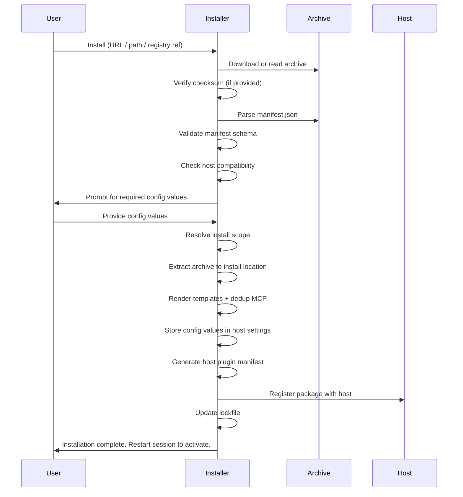

# Install Lifecycle

## Sequence

```mermaid
sequenceDiagram
    participant User
    participant Installer
    participant Archive
    participant Host

    User->>Installer: Install (URL / path / registry ref)
    Installer->>Archive: Download or read archive
    Installer->>Installer: Verify checksum (if provided)
    Installer->>Archive: Parse manifest.json
    Installer->>Installer: Validate manifest schema
    Installer->>Installer: Check host compatibility
    Installer->>User: Prompt for required config values
    User->>Installer: Provide config values
    Installer->>Installer: Resolve install scope
    Installer->>Installer: Extract archive to install location
    Installer->>Installer: Render templates + dedup MCP
    Installer->>Installer: Store config values in host settings
    Installer->>Installer: Generate host plugin manifest
    Installer->>Host: Register package with host
    Installer->>Installer: Update lockfile
    Installer->>User: Installation complete. Restart session to activate.
```

## Step Details

1. **Initiate install.** The user invokes the installer with a package reference: a URL, local file path, or registry query (e.g., `ccpkg install api-testing` or `ccpkg install https://example.com/api-testing-1.0.0.ccpkg`).

2. **Acquire archive.** The installer downloads or reads the `.ccpkg` file. For URLs, the installer MUST use HTTPS. For registry references, the installer resolves the package name to a URL via configured registries.

3. **Verify checksum.** If the manifest or registry entry includes a `checksum` field, the installer MUST compute the SHA-256 hash of the archive and compare it. Mismatches MUST abort installation.

4. **Parse manifest.** The installer reads `manifest.json` from the archive root. If the file is missing or invalid JSON, installation MUST abort.

5. **Validate manifest.** The installer validates the manifest against the ccpkg manifest schema. Invalid manifests MUST abort installation with a descriptive error.

6. **Check compatibility.** If the manifest includes a `compatibility` object, the installer checks whether the current host satisfies the declared constraints. Unsatisfied constraints SHOULD produce a warning. The installer MAY allow the user to proceed despite warnings.

7. **Collect config values.** For each config slot with `required: true` that is not already configured, the installer MUST prompt the user. For `secret` type slots, the prompt SHOULD mask input.

8. **Resolve install scope.** The install scope determines where the package is extracted. Resolution order:
   - Explicit user flag (`--scope user` or `--scope project`).
   - Author hint from `manifest.scope`.
   - Default: `user`.

9. **Extract archive.** The installer extracts the archive contents to the install location:
   - **User scope:** `~/.ccpkg/plugins/{name}/`
   - **Project scope:** `{project-root}/.ccpkg/plugins/{name}/`

   If a previous version exists at the install location, the installer MUST remove it before extraction.

10. **Render templates and deduplicate MCP servers.** The installer processes `.mcp.json` and `.lsp.json` templates, replacing `${config.VARIABLE_NAME}` markers with resolved values. For MCP servers, the installer SHOULD check for duplicates before writing:

    a. For each server entry, compute its identity tuple (key_name, origin) as defined in Server Deduplication (see [Component Types](#component-types)).

    b. If no matching entry exists in `shared_mcp_servers`: render the template, merge into the host config, and add the server to `shared_mcp_servers` with `declared_by` set to the current package.

    c. If a match exists, compare versions. Treat `null`/unknown versions as lower than any concrete semver version. If both are `null`/unknown, treat them as equal.

       - If the incoming version is higher: re-render using the incoming package's template, update `active_source` and `version`, and append the package to `declared_by`.

       - If the incoming version is equal or lower (including both `null`): skip rendering and append the package to `declared_by` only.

    d. If the key_name matches but the origin differs (conflict):

       - **Interactive mode**: warn the user and offer resolution options: keep the existing server, replace it, or install both under distinct keys.

       - **Non-interactive mode**: fail the install with a non-zero exit status and a descriptive error. Implementations MAY allow a preconfigured conflict policy (e.g., via CLI flags) to resolve without prompting.

    e. If the user has disabled dedup for this server (`dedup: false`), skip dedup checks and install the server under a package-scoped key (e.g., `{key_name}#{package_name}`). The installer MUST record the concrete key in the lockfile so uninstall can identify the correct entry.

    Rendered `.lsp.json` files are written to the install location without deduplication (LSP server dedup is deferred to a future spec version).

11. **Store config.** Config values are persisted in the host's settings file under `packages.{name}`.

12. **Generate host plugin manifest.** The installer generates the host's expected plugin manifest inside the install directory from the ccpkg manifest metadata. The manifest path and format are defined in the host's adoption specification. See [Plugin Registration](/specification/install-lifecycle#plugin-registration) for details.

13. **Register with host.** The installer registers the package with the host's extension system using the adapter operations defined in the host's [adoption specification](/assistants/). This ensures the host discovers the package on next session start.

14. **Update lockfile.** The installer writes or updates `ccpkg-lock.json` at the scope root (e.g., `~/.ccpkg/ccpkg-lock.json` for user scope). See [Lockfile Format](/specification/lockfile#lockfile-format).

15. **Notify user.** The installer informs the user that installation is complete. Components become available on the next session start (see [Appendix D](/specification/appendices#appendix-d-future-host-integration-targets) for hot-reload aspirations).

## Uninstall

Uninstalling a package reverses the install process:

1. **Remove the package directory** from the install location (`~/.ccpkg/plugins/{name}/` or `{project-root}/.ccpkg/plugins/{name}/`).
2. **Deregister from host.** Remove the package registration from the host's settings using the adapter operations defined in the host's adoption specification.
3. **Remove or reassign MCP servers.** For each MCP server the package declared:

   a. If this package is the only entry in the server's `declared_by` list: remove the server from the host config and from `shared_mcp_servers`.

   b. If other packages remain in `declared_by`: remove this package from the list. If this package was the `active_source`, select the remaining package with the highest version, re-materialize its MCP template, re-render with that package's config values, and update `active_source`. For archive-backed packages, re-extract from the archive cache. For linked packages (`source: link:...`), read the template directly from the linked directory. If this package was not the active source, no config change is needed.

   c. If the server has `dedup: false`: remove only this package's copy. Other packages' copies are independent and unaffected.
4. **Remove lockfile entry.** Remove the package entry from `ccpkg-lock.json`.
5. **Remove config values.** Remove config values from host settings. Secrets SHOULD require explicit user confirmation before removal.
6. **Notify user.** Inform the user that a session restart is required to fully deactivate the package's components.

## Update

Package updates MUST be manual and explicit. The installer MUST NOT automatically update packages or check for updates at session start.

The update process:

1. User invokes update for a specific package or all packages.
2. Installer resolves the latest version satisfying the manifest's semver range.
3. If a newer version is available, the installer downloads, verifies, and installs it.
4. The lockfile is updated with the new pinned version.
5. Config values are preserved unless the new version introduces new required config slots, in which case the user is prompted.

An installer SHOULD provide an `outdated` command that checks configured registries and reports available updates without applying them.

## Dev Mode (Link / Unlink)

Installers SHOULD support a dev mode that creates a symbolic link from the plugins directory to a local source directory. This allows package authors to iterate on skills, hooks, and commands without re-packing after every change.

### Link

1. **Validate source.** The installer validates that the target directory contains a valid `manifest.json`.
2. **Collect config values.** The installer prompts for any required config values, same as a normal install.
3. **Generate host plugin manifest.** The installer generates the host's expected plugin manifest inside the source directory from the manifest metadata (same mapping as install step 12).
4. **Create symlink.** A symbolic link is created at `~/.ccpkg/plugins/{name}` pointing to the source directory.
5. **Register with host.** The installer registers the package with the host using the adapter operations defined in the host's adoption specification, renders templates, and stores config values.
6. **Update lockfile.** The lockfile records the package with `"source": "link:{absolute-path}"`, `"linked": true`, and `"generated_plugin_manifest": true` (if the host plugin manifest was created by ccpkg rather than pre-existing).

### Unlink

1. **Remove symlink.** Remove the symlink from `~/.ccpkg/plugins/{name}`.
2. **Clean up generated files.** If the lockfile entry has `"generated_plugin_manifest": true`, remove the host plugin manifest directory from the source directory. If the manifest was pre-existing (not generated by ccpkg), leave it in place.
3. **Deregister from host.** Remove the package registration from the host's settings and remove the lockfile entry.
4. **Preserve source.** The source directory itself MUST NOT be deleted.

Linked packages MUST be distinguishable from installed archives in listings and status output.

### Session-Only Testing

For quick one-off testing without any persistent side effects, developers can use the host's plugin directory CLI flag (if supported). This loads the plugin for a single session only — no symlinks, no lockfile entries, no settings modifications. Consult the host's documentation for the specific flag name.

---

# Host Integration

ccpkg integrates with each host's extension or plugin system, leveraging the host's runtime for component registration and namespace isolation. The specific integration mechanism is defined in each host's [adoption specification](/assistants/).

## Bootstrap

On first use, ccpkg registers itself with the host's extension discovery system. The bootstrap process varies by host — some use marketplace registration, others use directory scanning or plugin manifests. The exact mechanism is defined in the host's adoption specification under `extension_model`.

## Plugin Registration

During installation, the installer performs two host-facing steps as defined by the host's adoption specification:

1. **Generate host plugin manifest.** The installer creates the host's expected plugin manifest inside the install directory, mapping ccpkg manifest fields (name, version, description, author) to the host's manifest format. The manifest path and format are defined in the host's `extension_model.manifest.filename` field. Package authors SHOULD NOT include host-specific plugin manifests in their archives. If a host-specific manifest is present, the installer MUST use the generated version and MAY warn the author.

2. **Register with host.** The installer registers the package with the host's extension system as described in the host's `extension_model.registration` mechanism. This ensures the host recognizes the package on the next session start.

These two steps — generating a plugin manifest and registering with the host — are the complete integration surface. The specific files and settings keys are defined in each host's [adoption specification](/assistants/).

## Namespacing

The host's plugin system provides namespacing automatically. The manifest `name` becomes the namespace prefix. All components are exposed as `{package-name}:{component-name}`, with component names derived from directory names (skills, agents) or file names (commands). No file editing or frontmatter rewriting is required.

For example, a package named `api-testing` containing `skills/run-suite/` exposes the skill as `/api-testing:run-suite`.

> **Note:** Some hosts flatten user-level component directories, preventing namespace isolation. This is why ccpkg installs packages through the host's plugin system rather than directly into user-level component directories.

## Scope and Settings

Each installation scope maps to a different host settings location. The specific paths vary by host and are defined in the host's [adoption specification](/assistants/) under `configuration.settings_paths`.

| Scope | Plugin Directory | Behavior |
|---|---|---|
| **User** | `~/.ccpkg/plugins/` | Available in all sessions |
| **Project** | `{project}/.ccpkg/plugins/` | Available in project sessions; settings committed to git |
| **Managed** | Per host adoption spec | Read-only; admins can allowlist ccpkg via host-specific managed settings |

Project-scoped settings are committed to version control. When a team member opens a project with ccpkg plugins declared in the host's settings file, the host prompts them to install the referenced plugins.

Settings precedence follows the host's resolution order: **Managed > Local > Project > User**. A managed setting always wins; a project setting overrides user-level for the duration of that project session.
