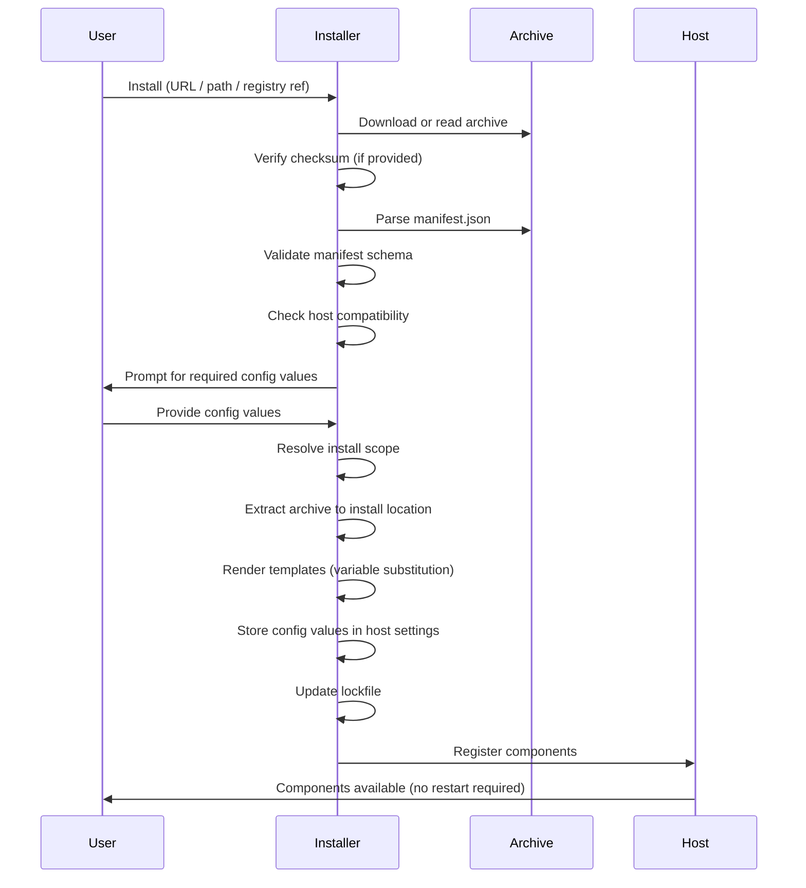

# Install Lifecycle

## Sequence

## Step Details

1. **Initiate install.** The user invokes the installer with a package reference: a URL, local file path, or registry query (e.g., `ccpkg install api-testing` or `ccpkg install https://example.com/api-testing-1.0.0.ccpkg`).

2. **Acquire archive.** The installer downloads or reads the `.ccpkg` file. For URLs, the installer MUST use HTTPS. For registry references, the installer resolves the package name to a URL via configured registries.

3. **Verify checksum.** If the manifest or registry entry includes a `checksum` field, the installer MUST compute the SHA-256 hash of the archive and compare it. Mismatches MUST abort installation.

4. **Parse manifest.** The installer reads `manifest.json` from the archive root. If the file is missing or invalid JSON, installation MUST abort.

5. **Validate manifest.** The installer validates the manifest against the ccpkg manifest schema. Invalid manifests MUST abort installation with a descriptive error.

6. **Check compatibility.** If the manifest includes a `compatibility` object, the installer checks whether the current host satisfies the declared constraints. Unsatisfied constraints SHOULD produce a warning. The installer MAY allow the user to proceed despite warnings.

7. **Collect config values.** For each config slot with `required: true` that is not already configured, the installer MUST prompt the user. For `secret` type slots, the prompt SHOULD mask input.

8. **Resolve install scope.** The install scope determines where the package is extracted. Resolution order:
   - Explicit user flag (`--scope user` or `--scope project`).
   - Author hint from `manifest.scope`.
   - Default: `user`.

9. **Extract archive.** The installer extracts the archive contents to the install location:
   - **User scope:** `~/.claude/packages/{name}/`
   - **Project scope:** `{project-root}/.claude/packages/{name}/`

   If a previous version exists at the install location, the installer MUST remove it before extraction.

10. **Render templates.** The installer processes `.mcp.json` and `.lsp.json` templates, replacing `${config.VARIABLE_NAME}` markers with resolved values. Rendered files are written to the install location.

11. **Store config.** Config values are persisted in the host's settings file under `packages.{name}`.

12. **Update lockfile.** The installer writes or updates `ccpkg-lock.json` at the scope root. See [Lockfile Format](/specification/lockfile).

13. **Register components.** The installer notifies the host of newly available components. Components SHOULD be available immediately without requiring a session restart.

## Uninstall

Uninstalling a package reverses the install process:

1. Remove the package directory from the install location.
2. Remove the package entry from the lockfile.
3. Remove config values from host settings (except secrets, which SHOULD require explicit confirmation).
4. Deregister components from the host.

## Update

Package updates MUST be manual and explicit. The installer MUST NOT automatically update packages or check for updates at session start.

The update process:

1. User invokes update for a specific package or all packages.
2. Installer resolves the latest version satisfying the manifest's semver range.
3. If a newer version is available, the installer downloads, verifies, and installs it.
4. The lockfile is updated with the new pinned version.
5. Config values are preserved unless the new version introduces new required config slots, in which case the user is prompted.

An installer SHOULD provide an `outdated` command that checks configured registries and reports available updates without applying them.

## Dev Mode (Link)

Installers SHOULD support a dev mode that creates a symbolic link from the packages directory to a local source directory. This allows package authors to iterate on skills, hooks, and commands without re-packing after every change.

The link process:

1. User invokes link with a path to a local package directory.
2. Installer validates that the directory contains a valid `manifest.json`.
3. A symbolic link is created at the install location pointing to the local directory.
4. The lockfile records the package with `"source": "link:{absolute-path}"`.
5. Components are registered normally. Changes to the linked directory take effect immediately.

Linked packages MUST be distinguishable from installed archives in listings and status output. The `unlink` operation removes the symlink and lockfile entry without deleting the source directory.
