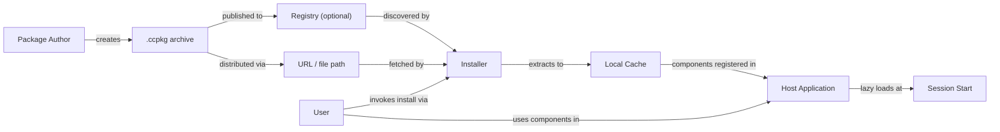
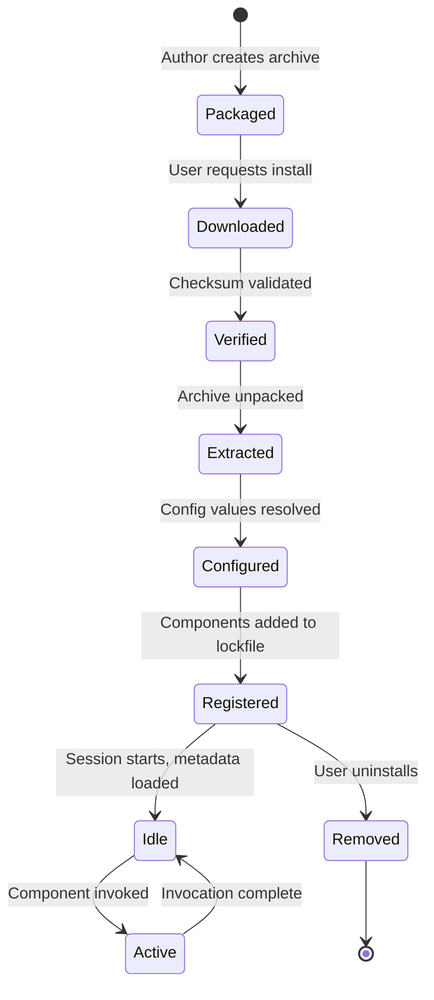

# ccpkg Specification

**Specification Version: 2026-02-14 (Draft)**

## Status

This specification is a **draft** and is subject to change. Feedback and contributions are welcome.

---

## Introduction

ccpkg is an open packaging format for distributing AI coding assistant extensions. A ccpkg archive is a self-contained ZIP file with a declarative manifest that bundles skills, agents, commands, hooks, MCP servers, LSP servers, and configuration instructions into a single portable unit.

The format is designed around a universal core—MCP, LSP, Agent Skills, and declarative configuration—with thin, tool-specific adapters that map these universal components to the conventions of individual AI coding assistants. This architecture enables a single package to work across Claude Code, OpenAI Codex CLI, GitHub Copilot, Google Gemini CLI, and other tools that adopt the format.

For implementation guides and tooling, visit the [ccpkg repository](https://github.com/zircote/ccpkg).

### Notational Conventions

The key words "MUST", "MUST NOT", "REQUIRED", "SHALL", "SHALL NOT", "SHOULD", "SHOULD NOT", "RECOMMENDED", "NOT RECOMMENDED", "MAY", and "OPTIONAL" in this document are to be interpreted as described in [BCP 14](https://datatracker.ietf.org/doc/html/bcp14) [[RFC 2119](https://datatracker.ietf.org/doc/html/rfc2119)] [[RFC 8174](https://datatracker.ietf.org/doc/html/rfc8174)] when, and only when, they appear in all capitals, as shown here.

### Relationship to Other Specifications

ccpkg builds on and references the following specifications:

| Specification | Role in ccpkg |
|---|---|
| [Model Context Protocol (MCP)](https://modelcontextprotocol.io/specification/2025-11-25) | MCP server configuration and transport definitions |
| [Agent Skills](https://agentskills.io/specification) | Skill and agent component format (SKILL.md, AGENT.md) |
| [Language Server Protocol (LSP)](https://microsoft.github.io/language-server-protocol/) | LSP server configuration |
| [Semantic Versioning 2.0.0](https://semver.org/) | Package version numbering |
| [SPDX License List](https://spdx.org/licenses/) | License identifiers |
| [JSON Schema](https://json-schema.org/) | Config schema validation |

---

## Design Principles

The following principles guide the design of the ccpkg format. Implementors SHOULD consider these principles when making decisions not explicitly covered by this specification.

1. **Self-contained archives.** Packages MUST be self-contained. Installation MUST NOT require network fetches, dependency resolution, or compilation. All executable content, configuration templates, and metadata MUST be present in the archive at packaging time.

2. **Tool-agnostic core.** The format MUST be tool-agnostic at its core. MCP, LSP, and Agent Skills are universal open standards. Tool-specific behavior is expressed through thin adapter mappings, not fundamental format changes.

3. **Deterministic installation.** Installation MUST be deterministic. Given the same package archive and the same user configuration, the installed result MUST be identical.

4. **No central authority.** No central registry is REQUIRED. Packages MAY be distributed via any URL, file path, or registry. Registries are optional and additive.

5. **Separated configuration.** User configuration MUST be separated from package contents. Secrets, preferences, and environment-specific values live outside the archive and are injected at install or load time.

6. **No install-time code execution.** Packages MUST NOT execute arbitrary code during installation. There are no postinstall scripts, no build steps, and no setup hooks. The installation process is purely declarative: extract, configure, register.

8. **No inter-package dependencies.** Inter-package dependencies are explicitly out of scope for this specification version. Each package MUST be self-contained and MUST NOT declare dependencies on other ccpkg packages. If a skill requires an MCP server, both MUST be packaged together in a single `.ccpkg` archive.

---

## Architecture

### Overview

ccpkg defines a packaging and distribution pipeline that connects package authors to end users through an optional registry layer. The architecture separates concerns across five roles: Author, Registry, Installer, Host, and User.

### Roles

| Role | Description |
|---|---|
| **Package Author** | Creates the `.ccpkg` archive containing components and a manifest. Authors are responsible for correctness, licensing, and security of package contents. |
| **Registry** | An OPTIONAL service or static file that indexes available packages. Registries provide discovery and version resolution but are not required for installation. |
| **Installer** | The tool or skill that processes `.ccpkg` archives. The installer downloads, verifies, extracts, configures, and registers packages. The ccpkg skill itself serves as the reference installer implementation. |
| **Host** | The AI coding assistant (e.g., Claude Code, Codex CLI) that loads and uses installed components. The host is responsible for component activation and runtime integration. |
| **User** | The person who installs and uses packages. Users provide configuration values, approve hook scripts, and control what packages are active. |

### Component Lifecycle

